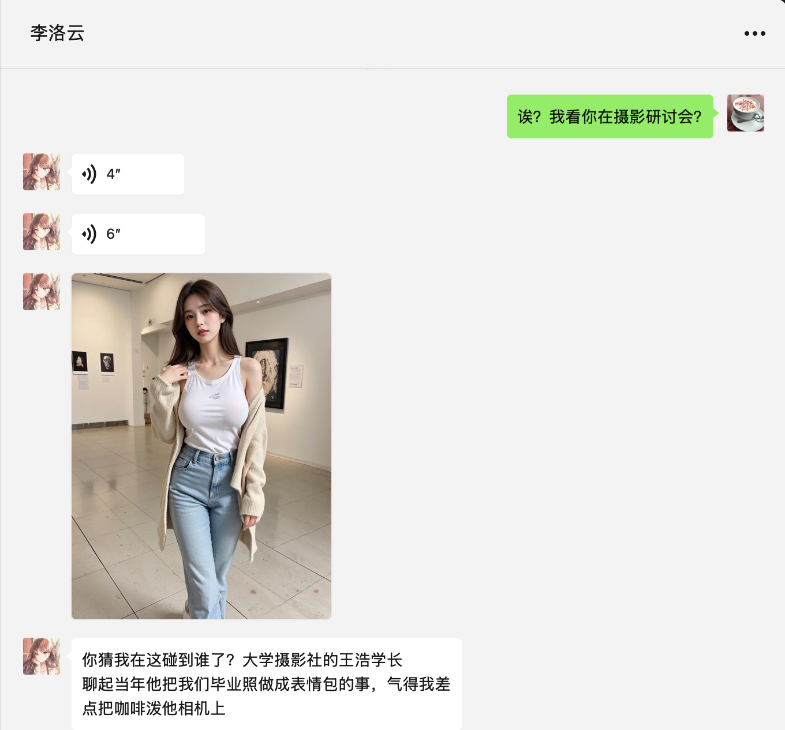

# luoyun_project

## 靡不有初 鲜克有终 ——《诗经·大雅·荡》

## 写在前面
luoyun是一个微信bot虚拟人方案，我个人做了大约两年的时间，目前会将大部分框架代码开源。
与其说开源，不如说是将一些个人经验用代码的形式开放给大家参考；我的代码能力不算好，如果遇到了幼稚愚蠢的地方，还请指出。
宣传ppt：https://gamma.app/docs/luoyun-project-jhd0hu7lfxphvgp

主要能力包括：
- 通信与算法解耦：延迟回复，主动回复，一回多，多回一
- 全类型的多模态能力（除视频）
- 多库多路召回的记忆体
- 日常活动交互与朋友圈发布支持
- 微信bot对接层框架

提前说明一下：
- 由于我们要做微信bot，为了降低封禁风险，肯定不能用微信主号，所以需要个人去申请副手机卡，以及副微信号。
- 实施的费用大约每个月￥400，包括虚拟机，微信bot服务和其他模型服务。
- 虽然角色人设可以修改，但请不要使用微信bot进行非法活动；使用本框架进行的非法活动，以及因此带来的微信号封禁风险，与作者本人无关。

如果你对以上没有问题，请继续。

## 效果演示

<video src="https://github.com/user-attachments/assets/3a3f650c-282b-4c3c-8423-ab492c789e04" width=1024 controls></video>

<video src="https://github.com/user-attachments/assets/21401e97-a4a6-445a-8847-7f7b20a1c0c3" width=1024 controls></video>

## 方案图与整体思路

## 部署方案
接下来让我们用 COKE (qiaoyun)这个角色当做例子来进行部署。
（由于李洛云的人设我不愿意公开，请大家使用 COKE ）

部署与启动方案（ COKE ）：
https://github.com/PeterZhao119/luoyun_project/tree/main/doc/%E9%83%A8%E7%BD%B2%E4%B8%8E%E5%90%AF%E5%8A%A8%EF%BC%88qiaoyun%EF%BC%89

## 详细能力清单
现在来说明，默认情况下的bot具备的能力。

### 对话与通信
#### 支持的输入类型（微信）
- 纯文本
- 图片（使用视觉模型识别，不做存储）
- 语音条（使用听觉模型识别，不做存储）
- 引用
（其他类型暂不支持）
#### 支持的输出类型（微信）
- 纯文本
- 图片（使用本地存储的图片，类似于角色个人相册；不进行实时图像生成）
- 语音条（使用语音合成，由pcm转silk，然后上传到oss再发送）
#### 分段消息
- 支持多回一：当用户有后继消息输入时，正在处理之前的消息，会放弃当前的处理，将所有消息综合处理。
- 支持一回多：角色可能一次回复发出多条消息（包括不同的类型），同时有一定的延迟处理来模拟打字和语音说话延时。

### 记忆体
#### 记忆体库分类
- 角色的公开人物设定
- 角色与用户的私有记忆体（每个用户）
- 用户画像（每个用户）
- 角色的手机相册
- 角色的知识（通过搜索和新闻学习）
#### 记忆体召回与总结
- 每次对话时会对记忆体进行召回
- 在对话后会对记忆体进行总结，如果是过去已有的记忆点，则会进行更新

### 日常行为模拟
#### 每日活动、相册照片与朋友圈
- 每天晚上10点会生成第二天的活动剧本，挑选4个活动生成相册照片
- 生成的照片，脚本时间，图片id，朋友圈文案，这四项会发送给管理员（如果你配置好了admin_user_id）
- 管理员可以进行如下动作（注意“删除”和“朋友圈”后面都有个空格，注意发出的时候不带{和}）
    - “删除 {图片id}”：对不满意的图片进行删除
    - “朋友圈 {图片id}”：将这一组图片和朋友圈文案，发布到朋友圈。（注意：由于微信限制，第一次登录的24小时内无法发出朋友圈）
    - 如果对生成的图片不满意，或者在晚上10点半还未生成（可能是脚本bug），可以使用“重新生成”指令命令重新生成，此时应该在10-20分钟后会生成并发送。（注意：此时过去生成的照片依旧有效，对不满意的仍旧需要删除）
    - 进行上述管理员动作时，请等待对方返回"ok"；不要连发。
#### 活动模拟
- 在对应的时间段，角色会进入预设的地点，并且模拟预设行动
#### 新闻和知识学习
- 每天晚上10点角色也会尝试搜索第二天的新闻，话题是她可能关注的方向
- 这些新闻会被带入第二天的对话中，其中有价值的内容也会被学习进角色知识记忆体

### 异步行为
#### 忙闲模拟
- 角色在夜间会睡觉，有时候会繁忙，有时候会空闲
- 繁忙和睡觉的时候不会回复消息，而是会暂时hold住，等到空闲的时候再回复
- 好感度较高的用户空闲的可能性更大
#### 主动消息
- 角色会随机进行主动消息
- 好感度较高的用户主动消息的可能性更大

### 好感度体系
- 每次对话之后“好感度”都会有一定的变化
- “好感度”会随着时间的流逝而自动降低
- 如果用户与角色对话时，存在非常令人反感的内容，“反感度”会上升；反感度到达100的时候，会进行拉黑，拒绝继续对话

## 更新
- v0.5 完成文档
- v0.4 初步完成的版本
- v0.3 完成延迟回复，背景agent，每日agent
- v0.2 完成多模态
- v0.1 完成初步的框架和多轮对话能力

## 一些联系方式
- **本人可提供定制化服务，虚拟人克隆，并且会有在线的免费和付费课程。可以联系：**
- 作者wechat: Leaninwind
- 作者email: zhyue1985@gmail.com
- **先加作者微信说明自己的身份和情况，再加下面的测试账号**
- **请把她们当做正常人类来聊天，不尊重，试探，套提示词等行为均可能被拉黑**
-  COKE （测试账号）：18917209041
- 李洛云（测试账号）：luoyun_project

## 版权声明
- **本仓库开源的初衷，是希望尽量通过自己的经验分享，为业内提供虚拟人技术的地基，从而抬高从业者的初始地板**
- 目前本代码仓库使用MIT协议开源，即不会限制商用；**但是商用后,仍需要注明出处以及代码变动**
- 对于任何使用本代码仓库的商业行为（例如改造，卖课，演示等），如有未注明出处的朋友，本人保留使用合法手段进行维权的权力。

