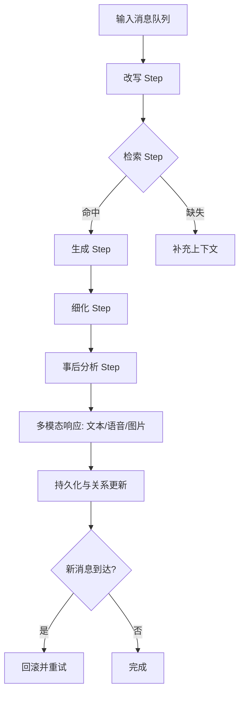

# 通过 agno-refer 重构 framework 层并用新 agent 架构重实现「乔云」技术评估

## 概览
- 目标：以 `agno-full` 为参考复核与更新报告，保持原有结构，结合当前代码仓库的实际实现，对齐 Agno v2 的 AgentOS、Workflows 2.0 与评估能力，明确「乔云」的重构路径与代码映射。
- 范围：`framework/agent/*`（基类、LLM 适配）、`qiaoyun/agent/*`（业务链条）、`qiaoyun/runner/*`（调度与状态机）、`qiaoyun/tool/*`（多模态工具）；尽量保持 `dao/*`、`entity/*` 接口不变。
- 参考：Agno 文档（AgentOS/Workflows/Evals/Knowledge/Tools/迁移指南）；评估接口包括 get/patch Eval Run 与 Demo 流水线，AgentOS UI 与 Slack 接口示例可作为观测与联动参考。

---

## 1. 复杂度分析

### 1.1 模块耦合度与依赖关系
- 框架层与状态枚举：`framework/agent/base_agent.py:28` 定义 `AgentStatus`；同步/异步基类分别在 `framework/agent/base_agent.py:40` 与 `framework/agent/base_agent.py:169`，提供生成器式 `run`、生命周期钩子与重试机制。
- LLM 适配与单轮调用：`framework/agent/llmagent/base_singleroundllmagent.py:32` 单轮 LLM Agent，模板化 `systemp/userp`、结构化输出（function call）、支持流式占位；`framework/agent/llmagent/doubao_llmagent.py:24` 适配 Ark/DouBao 模型并做模型名映射。
- 业务链路（乔云）：`qiaoyun/agent/qiaoyun_chat_agent.py:29` 主编排调用查询改写→检索→生成→细化→事后分析；生成后以多模态响应向外抛出 `AgentStatus.MESSAGE`。
- 调度与状态机：`qiaoyun/runner/qiaoyun_handler.py:18` 引入 `AgentStatus` 并在 `qiaoyun/runner/qiaoyun_handler.py:159,163,166,169,172` 判定 `FAILED/ROLLBACK/CLEAR/FINISHED/MESSAGE`；并发通过 `dao/lock.MongoDBLockManager` 控制（`qiaoyun/runner/qiaoyun_handler.py:83`）。
- 多模态工具：语音在 `qiaoyun/tool/voice.py:16` 依赖 `framework/tool/text2voice/minimax.py`，返回 `(url, voice_length)`；图片在 `qiaoyun/tool/image.py:15` 依赖 `framework/tool/text2image/liblib.py` 与 OSS 上传（`qiaoyun/tool/image.py:163`）。
- 运行入口：主/后台并发在 `qiaoyun/runner/qiaoyun_runner.py:17` 通过 `asyncio.gather` 启动两个循环任务。

### 1.2 新 Agent 架构与现有代码兼容性
- 运行模型映射：现有 `BaseAgent` 的生成器式 `run`（`framework/agent/base_agent.py:61`）与生命周期钩子可自然映射到 Agno 的 Agent 执行与流式更新；链式多 Agent 编排适合拆分为 Workflows 2.0 的 Step/Conditional/Parallel。
- 能力映射：
  - 工具层：语音/图片工具可注册为 Agno Tools；检索可接入 Agno Knowledge 与自定义 Retriever，支持 Hybrid + Rerank（参考 Cohere Reranker）。
  - 结构化输出：当前 `output_schema`（如 `qiaoyun/agent/qiaoyun_chat_response_agent.py:72`）与 Agno Structured Output对齐，可用 tool/function call 约束格式。
  - 评估与观测：接入 Accuracy/Performance/Reliability Evals（Demo `evals_demo.py`），结合 AgentOS UI 与 Slack 接口示例进行联动观测。
- 兼容性注意：Ark/DouBao 未在 Agno 官方模型列表中，建议以自定义 Tool 封装或兼容模型替代；Runner 状态需与 Workflow 执行状态统一映射，避免双状态源导致竞态。

### 1.3 重构代码量与影响范围估算
- 直接改造占比（估算）：
  - `qiaoyun/agent`：约 60%–75%（链式逻辑拆分为 Workflow Steps，保留 prompts/输出契约）。
  - `qiaoyun/runner`：约 40%–60%（将状态推进与锁控制逐步下沉到 Workflow 上下文与统一状态源）。
  - `framework/agent`：约 50%（接口契约与错误语义对齐流式/异步）。
  - `framework/tool`：约 15%–25%（统一工具注册与依赖注入）。
- 外部边界影响：Connector 输出消息与格式需兼容现有实现；DAO/Entity 尽量不变，必要时增加评估指标与 Workflow 上下文字段。

---

## 2. 优势分析

- 性能提升预期
  - 流式/异步执行降低端到端时延；检索/生成可并行化提升吞吐。
  - 混合检索 + 重排序提升上下文命中率，减少无效 Token 消耗。
  - 评估闭环：引入 Accuracy/Performance/Reliability Evals 持续迭代与回归。
- 可维护性与扩展性
  - 工作流化拆分链路为可视化 Step，日志命名清晰、边界明确。
  - 结构化输出与 Guardrails 降低提示工程脆弱性，提升可验证性。
  - 工具注册与依赖注入统一管理多模态与外部服务，增强复用。
- 开发效率
  - AgentOS API/UI 便于调试与回溯；结合 Slack 接口示例实现快速联动验证。
  - 评估套件与日志路由降低自建评测成本；迁移指南与变更日志便于版本演进。

---

## 3. 劣势分析

- 迁移技术风险
  - Ark 模型替换或二次封装存在兼容风险，需验证输出一致性与成本
  - 双状态源问题：Runner 自有状态与 Workflow 状态需统一映射，避免竞态
  - 锁与并发模型变化：串行锁策略与并行步骤需做一致性与幂等校验
- 向后兼容性挑战
  - Connector 的消息格式与集合命名不一致（如 `gewechat` 与主线集合差异）需统一适配
  - 历史会话结构变化导致既有数据读取逻辑调整，需提供迁移脚本
- 团队学习成本
  - Workflows/Steps/Tools/Guardrails/Observability 等理念学习周期
  - 新评估框架与数据面板引入的维护开销

---

## 4. 实施建议

### 4.1 分阶段重构路线图
- 第 0 阶段：桥接与基座
  - 引入 Agno 依赖与最小可用 Agent 封装，保留现有 Runner 入口与消息面。
  - 以自定义 Tool 封装 Ark/DouBao 与现有多模态工具，统一鉴权与参数约定。
- 第 1 阶段：核心聊天链迁移
  - 将「改写→检索→生成→细化→事后分析」拆为 Workflow Steps（顺序/条件/并行）。
  - `QiaoyunChatAgent` 重写为 Workflow Orchestrator，保留结构化输出与多模态响应格式。
- 第 2 阶段：工具与知识整合
  - 分离语音/图片工具为独立工具集，统一依赖注入与参数验证。
  - 引入 Knowledge/Filter 与自定义 Retriever，实现 Hybrid + Rerank 检索链。
- 第 3 阶段：调度与状态统一
  - 将 Runner 的状态推进与锁控制迁移至 Workflow 上下文，保持 DAO 的消息持久化与会话截断。
  - 统一 `AgentStatus` 与 Workflow 状态映射，清理重复判断与竞态来源。
- 第 4 阶段：可观测与评估
  - 接入 OpenTelemetry 与 LangDB/第三方平台，落地性能/可靠性/准确性评估流水线。
  - 建立回归基线与灰度策略，支撑持续优化与放量。

### 4.2 测试与验证方案
- 单元与集成
  - Agent Step 的输入/输出契约测试（含结构化输出、异常与重试）
  - 工具层外部依赖的契约与容错测试（语音/图片/检索）
- 可靠性评估
  - 断言工具调用序列与次数（Single/Multiple Tool Reliability）
  - 异步与流式路径的中断恢复验证
- 性能评估
  - 端到端时延与步骤耗时分解，内存占用与并行度
  - 存储交互成本与上下文构建开销
- 回归与数据一致性
  - 对比 Ark 与替代模型的输出一致性（BLEU/ROUGE/任务成功率）
  - 会话截断与历史回放一致性验证
 - Evals 集成
   - 准备 `evals_demo.py` 风格的评估入口（参考 Accuracy/Performance/Reliability Evals）。
   - 通过 API 获取与更新评估结果（`get /eval-runs/{eval_run_id}`、`patch /eval-runs/{eval_run_id}`）。

### 4.3 衡量指标
- 性能
  - p50/p95 响应时延、吞吐、并行度、Token 使用效率
- 可靠性
  - 工具调用准确率、失败重试率、并发冲突率、锁等待时间
- 准确性
  - 输出完整性与结构化字段填充率、检索命中率、任务成功率
- 运营与维护
  - 回归通过率、变更影响面（改动行数/文件数）、线上观察到的错误等级分布

---

## 5. 兼容性映射与重构清单（摘取）

| 现有组件 | 新架构对应 | 变更要点 |
| --- | --- | --- |
| `framework/agent/BaseAgent` | Streaming/Async Agent | 生命周期与状态映射、生成器与流式统一 |
| `BaseSingleRoundLLMAgent` | Structured Output Agent | templates 与 `output_schema` 映射 function call |
| `DouBaoLLMAgent`+Ark | 自定义 Tool 或兼容模型 | 保留输出模式与参数约定，验证一致性与成本 |
| `QiaoyunChatAgent` | Workflow Orchestrator | 拆分 Step、命名日志与错误边界清晰 |
| `qiaoyun/tool/*` | Tools Registry | 依赖注入/鉴权、参数验证与限流 |
| `qiaoyun/runner/*` | Workflow Session | 状态推进与锁整合、消息持久化保持一致 |

---

## 6. 关键代码参考
- `framework/agent/base_agent.py:61` 生成器式 `run` 与状态推进；`framework/agent/base_agent.py:169` 异步基类。
- `framework/agent/llmagent/base_singleroundllmagent.py:110` 缺省值深度填充；`framework/agent/llmagent/base_singleroundllmagent.py:133` 结构化输出与 tool/function call。
- `framework/agent/llmagent/doubao_llmagent.py:24` Ark/DouBao 适配与模型映射。
- `qiaoyun/agent/qiaoyun_chat_agent.py:65` 生成与多模态归一化；`qiaoyun/agent/qiaoyun_chat_agent.py:101` 事后分析。
- `qiaoyun/agent/qiaoyun_chat_response_agent.py:72` 输出 schema；`qiaoyun/agent/qiaoyun_chat_response_agent.py:150` 关系变化与未来响应写回。
- `qiaoyun/tool/voice.py:16` 语音生成与时长计算；`qiaoyun/tool/image.py:168` 图片上传与签名 URL。
- `qiaoyun/runner/qiaoyun_handler.py:152` 新消息打断与回滚；`qiaoyun/runner/qiaoyun_runner.py:17` 并发运行入口。

---

## 7. 过程可视化

---

## 8. 风险缓解与落地建议
- 为 Ark/DouBao 提供工具化封装与回退模型，建立 A/B 输出一致性监测；必要时引入兼容模型灰度。
- 迁移初期保留 Runner 状态推进，逐步将职责下沉到 Workflow 并统一状态源；加强并发一致性校验。
- 对关键工具调用设置 Guardrails 与限流，避免外部依赖抖动放大；重要链路增加重试与幂等。
- 建立评估与告警面板（Accuracy/Performance/Reliability），配合 AgentOS UI/Slack 联动，达标后扩大覆盖面。

---

## 9. 结论
- 采用 Agno 的新 Agent 架构与 Workflows 将提升「乔云」体系的性能、可维护性与可观测性。
- 主要挑战在 Ark 适配、状态统一与并发一致性，建议分阶段推进并以评估指标驱动灰度发布与回归。