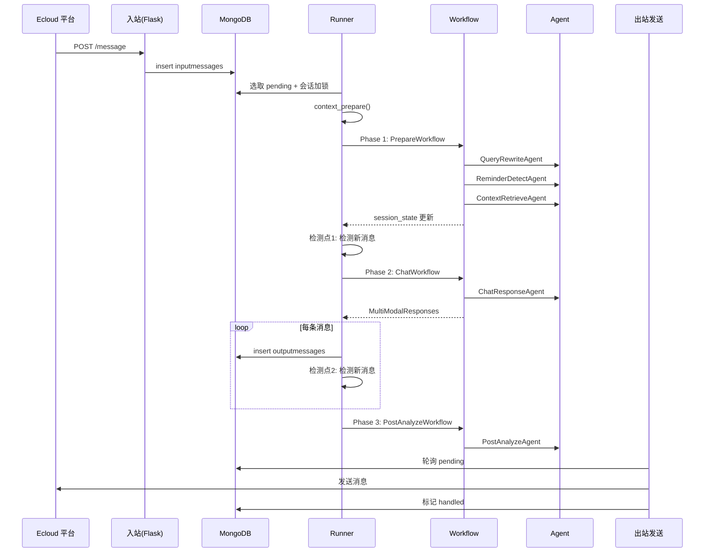

# Coke Project 架构设计说明书

> 版本：v2.0  
> 日期：2025-12-07  
> 状态：基于 Agno 框架重构完成

---

## 1. 架构概述

### 1.1 系统定位与业务目标

- 面向企业与个人的智能助手中枢，统一接入微信/ecloud 以及本地终端，提供文本/语音/图片等多模态能力
- 通过 **Agno Workflow** 实现 Agent 编排，完成「准备阶段 → 回复生成 → 后处理分析」的对话处理流程
- 以 MongoDB 为持久化与调度基座，保证消息有序处理与结果可靠送达
- 支持主动消息触发、提醒功能、关系管理等高级交互能力

### 1.2 技术架构特点

- **Agno 框架**：采用 Agno 2.x 作为核心 Agent 框架，替代原自研框架
- **Workflow 分段执行**：支持消息打断机制，在 Workflow 阶段间检测新消息
- **Tool 化架构**：将向量检索、提醒管理、多模态处理等封装为 Agno Tool
- **DeepSeek 模型**：统一使用 DeepSeek 作为 LLM 后端

### 1.3 架构设计原则

- 简单单体优先：后端为 Python 单体服务，分为入站、核心处理、出站三类进程
- 异步与幂等：通过会话级分布式锁与消息状态机控制并发与重入
- Workflow 不访问数据库：Workflow 专注于业务逻辑编排，数据访问由 Tool 和 Runner 层负责
- 分段执行与打断检测：Runner 层控制 Workflow 分段执行，支持消息打断机制

### 1.4 关键术语与概念

| 术语 | 说明 |
|------|------|
| Connector | 平台接入层，包含入站控制器与出站发送器（ecloud、Terminal） |
| Adapter | 消息标准化与反向适配（`connector/ecloud/ecloud_adapter.py`） |
| Runner | 核心处理调度器（`agent/runner/agent_handler.py`），负责 Workflow 调度、消息打断检测 |
| Workflow | Agno 流程编排（`agent/agno_agent/workflows/`），包含 Prepare、Chat、PostAnalyze |
| Agent | Agno Agent 定义（`agent/agno_agent/agents/__init__.py`），使用 DeepSeek 模型 |
| Tool | Agno Tool 封装（`agent/agno_agent/tools/`），包含检索、提醒、多模态处理 |
| session_state | 会话上下文，在 Workflow 间传递 |

---

## 2. 架构视图

### 2.1 系统架构图

```
┌─────────────────────────────────────────────────────────────────┐
│                     Connector 层 (保留不变)                      │
│  ┌─────────────┐    ┌─────────────┐    ┌─────────────┐         │
│  │ ecloud_input│    │   Adapter   │    │ecloud_output│         │
│  │  (Flask)    │───▶│ 消息格式转换 │◀───│  (轮询发送)  │         │
│  └─────────────┘    └─────────────┘    └─────────────┘         │
│         │                                      ▲                │
│         ▼                                      │                │
│  ┌──────────────────────────────────────────────────┐          │
│  │              inputmessages / outputmessages       │          │
│  │                    (MongoDB 消息队列)              │          │
│  └──────────────────────────────────────────────────┘          │
└─────────────────────────────────────────────────────────────────┘
                              │
                              ▼
┌─────────────────────────────────────────────────────────────────┐
│                      Runner 层 (agent/runner)                    │
│  ┌─────────────────────────────────────────────────────────┐   │
│  │  context_prepare() → 构建 session_state                 │   │
│  │  main_handler() → 调用 Agno Workflow，处理 Response      │   │
│  │  消息打断检测 → 在 Workflow 阶段间检测新消息              │   │
│  └─────────────────────────────────────────────────────────┘   │
└─────────────────────────────────────────────────────────────────┘
                              │
                              ▼
┌─────────────────────────────────────────────────────────────────┐
│                Agno Workflow 层 (agent/agno_agent/workflows)     │
│  ┌─────────────────────────────────────────────────────────┐   │
│  │  PrepareWorkflow (Phase 1):                             │   │
│  │    QueryRewriteAgent → ReminderDetectAgent →            │   │
│  │    ContextRetrieveAgent                                 │   │
│  │                                                          │   │
│  │  ChatWorkflow (Phase 2):                                │   │
│  │    ChatResponseAgent → 生成多模态回复                    │   │
│  │                                                          │   │
│  │  PostAnalyzeWorkflow (Phase 3):                         │   │
│  │    PostAnalyzeAgent → 更新关系和记忆                     │   │
│  └─────────────────────────────────────────────────────────┘   │
└─────────────────────────────────────────────────────────────────┘
                              │
                              ▼
┌─────────────────────────────────────────────────────────────────┐
│                  Agno Agent/Tool 层                              │
│  ┌─────────────────────────────────────────────────────────┐   │
│  │  Agents (agents/__init__.py):                                    │   │
│  │    query_rewrite_agent, reminder_detect_agent,          │   │
│  │    context_retrieve_agent, chat_response_agent,         │   │
│  │    post_analyze_agent                                   │   │
│  │                                                          │   │
│  │  Tools (tools/):                                        │   │
│  │    context_retrieve_tool, reminder_tools, voice_tools,  │   │
│  │    image_tools, album_tools                             │   │
│  └─────────────────────────────────────────────────────────┘   │
└─────────────────────────────────────────────────────────────────┘
                              │
                              ▼
┌─────────────────────────────────────────────────────────────────┐
│                    Agno Framework + DeepSeek                     │
│  ┌─────────────┐  ┌─────────────┐  ┌─────────────┐             │
│  │ agno.agent  │  │ agno.models │  │ agno.tools  │             │
│  │ Agent 基类  │  │ DeepSeek    │  │ Tool 装饰器 │             │
│  └─────────────┘  └─────────────┘  └─────────────┘             │
└─────────────────────────────────────────────────────────────────┘
```

### 2.2 消息处理序列图



### 2.3 代码结构

```
coke/
├── agent/                              # 核心业务层 (Agno 实现)
│   ├── agno_agent/                     # Agno Agent/Workflow/Tool
│   │   ├── agents/                     # Agent 定义 (预创建在 __init__.py)
│   │   ├── workflows/                  # Workflow 编排
│   │   │   ├── prepare_workflow.py     # 准备阶段
│   │   │   ├── chat_workflow.py        # 回复生成
│   │   │   ├── post_analyze_workflow.py
│   │   │   └── future_message_workflow.py
│   │   ├── tools/                      # Tool 定义
│   │   │   ├── context_retrieve_tool.py
│   │   │   ├── reminder_tools.py
│   │   │   ├── voice_tools.py
│   │   │   ├── image_tools.py
│   │   │   └── album_tools.py
│   │   ├── schemas/                    # Pydantic 响应模型
│   │   └── services/                   # 业务服务
│   ├── runner/                         # Runner 层
│   │   ├── agent_handler.py            # 主消息处理
│   │   ├── agent_background_handler.py # 后台任务
│   │   ├── agent_runner.py             # 并发调度入口
│   │   └── context.py                  # 上下文构建
│   ├── prompt/                         # Prompt 模板
│   ├── tool/                           # 多模态工具封装
│   └── util/                           # 业务工具
│
├── connector/                          # 平台接入层
│   ├── ecloud/                         # E云管家连接器
│   └── terminal/                       # 终端测试连接器
│
├── dao/                                # 数据访问层
├── entity/                             # 领域实体
├── util/                               # 通用工具
├── conf/                               # 配置管理
├── framework/tool/                     # 底层工具封装
└── tests/                              # 测试用例
```

---

## 3. 技术选型

### 3.1 核心技术栈

| 类别 | 技术选型 | 说明 |
|------|----------|------|
| Agent 框架 | Agno >= 2.0.0 | 生产级 Agent 框架 |
| LLM 模型 | DeepSeek | 通过 Agno 模型适配器调用 |
| Web 框架 | Flask 3.1.0 | 入站控制器 |
| 数据库 | MongoDB + pymongo 4.12.0 | 文档存储 + 向量检索 |
| 语音识别 | 阿里云 NLS 1.1.0 | 实时语音转文字 |
| 语音合成 | MiniMax | 文字转语音 |
| Embedding | DashScope 1.23.2 | 文本向量化 |
| 对象存储 | 阿里云 OSS | 文件存储 |

### 3.2 关键技术决策

- **Agno 框架替代自研**：减少维护成本，获得标准化的 Agent 编排能力
- **自定义 Workflow 类**：不使用 Agno 原生 Step-based Workflow，以支持 Runner 层控制打断检测
- **Tool 封装策略**：将向量检索、提醒管理等复杂逻辑封装为 Agno Tool
- **消息打断机制**：Runner 层在 Workflow 阶段间检测新消息，支持对话上下文连贯

---

## 4. Workflow 详解

### 4.1 执行流程

```
Phase 1: PrepareWorkflow (2-4秒)
├── QueryRewriteAgent - 问题重写，生成检索查询词
├── ReminderDetectAgent - 检测提醒意图
└── ContextRetrieveAgent - 向量检索上下文
     ↓
[检测点 1] Runner 层检测新消息
     ↓
Phase 2: ChatWorkflow (3-10秒)
└── ChatResponseAgent - 生成多模态回复
     ↓
[检测点 2] 每条消息发送后检测新消息
     ↓
Phase 3: PostAnalyzeWorkflow (2-5秒)
└── PostAnalyzeAgent - 更新关系、记忆
```

### 4.2 消息打断机制

当检测到新消息时：
- 检测点 1 触发：丢弃当前处理，返回 rollback
- 检测点 2 触发：停止发送剩余消息，跳过 PostAnalyze
- 已发送的消息不会被撤回，记录到对话历史
- 新消息会在下一轮处理时看到完整的历史上下文

### 4.3 Agent 与 Tool

| Agent/Tool | 功能 |
|------------|------|
| query_rewrite_agent | 问题重写，生成检索查询词 |
| reminder_detect_agent | 检测提醒意图，调用 reminder_tool |
| context_retrieve_agent | 调用 context_retrieve_tool 检索上下文 |
| chat_response_agent | 生成多模态回复 |
| post_analyze_agent | 后处理分析，更新关系和记忆 |
| context_retrieve_tool | 向量检索（角色设定、用户资料、知识库） |
| reminder_tools | 提醒 CRUD 操作 |
| voice_tools | 语音转文字、文字转语音 |
| image_tools | 图片识别、图片生成 |

---

## 5. 运行与运维

### 5.1 启动命令

```bash
# 入站服务
python connector/ecloud/ecloud_input.py

# 核心处理
python -m agent.runner.agent_runner

# 出站发送
python connector/ecloud/ecloud_output.py
```

### 5.2 关键环境变量

| 变量 | 说明 |
|------|------|
| `DEEPSEEK_API_KEY` | DeepSeek API 密钥 |
| `DASHSCOPE_API_KEY` | 阿里云 DashScope API 密钥 |
| `OSS_ACCESS_KEY_*` | OSS 存储密钥 |
| `NLS_*` | 阿里云语音服务配置 |
| `CONF` | 环境配置（默认 `dev`） |

---

本说明书依据 Agno 框架重构后的代码库编制，作为设计/开发/部署的统一参考。
