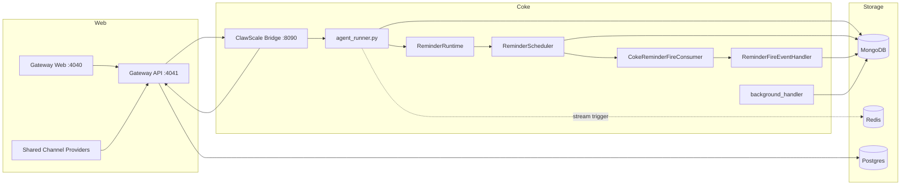

# Architecture Reference

This is Coke's canonical architecture document. `docs/architecture.md` is kept
only as a compatibility symlink for older references.

This document describes the current ClawScale-backed runtime wired in this
repository, including the gateway-hosted shared-channel experiments that feed
the same Coke worker pipeline.

This document describes runtime topology. Ownership boundaries are defined in
`docs/superpowers/specs/2026-05-19-frontend-platform-channel-boundary-design.md`.
Planning surfaces and ownership systems are related but not identical.

## 1. Runtime Topology

The production stack consists of:

- `agent/runner/agent_runner.py`
  - runs Coke message workers
  - boots the in-process reminder runtime
  - runs background maintenance jobs
- `agent/reminder/runtime.py`
  - owns the in-process Reminder Runtime object
  - holds the runtime contract, scheduler, and fire consumer wired by Coke
- `agent/runner/reminder_scheduler.py`
  - rebuilds APScheduler reminder jobs from MongoDB `reminders.next_fire_at`
  - emits structured reminder fired events to the configured fire consumer
- `agent/runner/reminder_fire_consumer.py`
  - adapts Reminder fired events to Coke's existing continuation handler
- `agent/runner/reminder_event_handler.py`
  - resolves the reminder output target back into conversation context
  - writes final reminder output through the Agent System output boundary
- `connector/clawscale_bridge/app.py`
  - validates bridge/internal integration requests
  - adapts Coke ingress and egress protocol traffic
  - waits for synchronous replies and promotes late replies
  - dispatches outbound replies to the gateway
- `gateway/`
  - serves the web UI on `4040`
  - serves the API on `4041`
  - hosts Platform, Channel, Reminder customer API, and Calendar Import routes in one process
  - keeps provider webhook normalization and outbound dispatch under Channel ownership
- data services
  - MongoDB for Coke runtime state, including visible `reminders`
  - Redis for stream wake-up / trigger events
  - Postgres for gateway state



## 2. Inbound Path

Current personal-channel inbound traffic comes through ClawScale:

```text
user channel
  -> gateway
  -> bridge /bridge/inbound
  -> MongoDB inputmessages
  -> optional Redis XADD
  -> agent workers
```

Active shared-channel experiments enter through provider-specific gateway
webhook routes before converging on the same Coke bridge and worker runtime:

```text
provider webhook
  -> gateway /gateway/evolution/whatsapp | /gateway/ecloud/wechat | /gateway/linq
  -> shared-channel provisioning and route binding
  -> bridge /bridge/inbound
  -> MongoDB inputmessages
  -> optional Redis XADD
  -> agent workers
```

Key points:

- `connector/clawscale_bridge/app.py` validates bridge requests and converts them into Coke input documents.
- `gateway/packages/api/src/gateway/message-router.ts` owns provider webhook
  normalization for active shared-channel experiments.
- `gateway/packages/api/src/lib/route-message.ts` and shared-channel
  provisioning map external senders onto Coke customers and delivery routes
  before handing messages to the bridge.
- `util/redis_stream.py` is only a wake-up path; MongoDB remains the source of truth.
- `agent/runner/message_processor.py` still acquires work from `inputmessages` and conversation locks in MongoDB.

Product notifications generated by gateway scheduling features, such as friend
requests and shared reminder requests, are not user inbound turns. Gateway
stores the `product_notifications` record, resolves the recipient account's
latest active `delivery_routes` row, and sends the notification through
`/api/outbound` as a push message. They should not be enqueued through
`/bridge/inbound`, because that path is reserved for user-originated turns and
request/response replies.

## 3. Worker Runtime

`agent/runner/agent_runner.py` now has three responsibilities:

1. run N message workers
2. boot one in-process Reminder System scheduler
3. run the background handler loop

Each worker:

1. checks queue mode
2. optionally drains Redis stream triggers
3. executes the shared handler from `create_handler(worker_id)`

`agent/runner/message_processor.py` still handles:

- message acquisition
- conversation locking
- batching pending messages for the same conversation
- final status updates

The Reminder System owns assistant-created reminders and internal follow-ups:

- `reminders` stores visible user reminders and internal agent follow-ups.
  Visible reminders are created through the
  `agent.agno_agent.tools.reminder_protocol` adapter. Internal follow-ups use
  `visibility=internal` and `fire_mode=followup`, are hidden from customer
  management surfaces, and fire through `ReminderFireEventHandler` into the
  normal Agent System runtime.
- `agent/reminder/runtime_contract.py` is the in-process Reminder Runtime
  Contract. Agno tools, PostAnalyze follow-up creation, and bridge reminder
  management adapters call this contract instead of owning reminder business
  behavior.
- `agent/reminder/runtime.py` is the in-process Reminder Runtime object owned
  by the worker runtime. It holds the runtime contract, scheduler, and fire
  consumer.
- reminder documents include schedule data, output target, lifecycle, and the
  next durable wake-up in `next_fire_at`
- visible reminder schedules may include optional `duration_minutes`, exposed
  as `durationMinutes` through Bridge/Gateway APIs; positive duration makes the
  reminder occupy calendar time, while absent duration remains a point reminder
- Bridge exposes `/bridge/internal/reminder-calendar-facts` for internal
  privacy-preserving busy interval reads; it filters by owner, visible
  reminders, active lifecycle state, bounded local date range, and occupied
  duration before returning busy intervals without reminder private details
- `ReminderScheduler` reconstructs active jobs from `reminders.next_fire_at` on
  startup and keeps APScheduler as an in-process wake-up mechanism only
- `ReminderScheduler` emits `ReminderFiredEvent` objects to a
  `ReminderFireConsumer`; Coke wires `CokeReminderFireConsumer` to the
  existing `ReminderFireEventHandler` so conversation lookup, locks, Agno
  `AgentInput`, and output delivery remain Coke continuation concerns.
- successful one-shot fired events complete the reminder, successful recurring
  fired events advance `next_fire_at`, and failed event handling marks the
  reminder failed

The legacy scheduled-action stack has been fully retired. All scheduled events,
including imported calendar reminders, now go through the Reminder Runtime. The
old scheduled-action MongoDB collections are no longer written to; existing
documents are inert.

## 4. Turn Processing Pipeline

The default turn pipeline is the single-Agent runtime defined in
`agent/agno_agent/runtime/agent_runtime.py`. The runner constructs an Agno
`Agent` per turn with the shared `agent_sessions` MongoDB session store and
Agno-managed history context (`add_history_to_context=True`,
`num_history_messages=20`). Runtime metadata is carried in per-turn
instructions, while the user message passed to Agno remains the raw input text.
The runtime registers async tool wrappers for the Interaction Agent. Domain
tools (`reminder_domain` and `scheduling_domain`) return structured
`DomainExecutionResult` JSON as the domain-to-Interaction-Agent contract:
operation facts, missing fields, safety boundaries, reply contracts, and
structured errors. Non-domain utility tools (`timezone`, `calendar_import`, and
`url_context`) continue to return `CapabilityResult` values for utility
visible-output behavior. The Interaction Agent owns final user-visible text
when non-empty; `DomainExecutionResult` values are trusted execution facts for
prompt grounding, traces, metrics, manager payloads, tests, and eval evidence,
not a production output rewrite or reply-quality gate. The scheduling domain
delegates execution to friend-link and shared-reminder tools:
`get_user_link`, `reset_user_link`, `disable_user_link`,
`list_friend_requests`, `accept_friend_request`, `reject_friend_request`,
`cancel_friend_request`, `list_friends`, `remove_friendship`, `block_account`,
`unblock_account`, `list_friend_calendar_facts`, `create_shared_reminder`,
`list_pending_shared_reminders`, `accept_shared_reminder`,
`reject_shared_reminder`, and `cancel_shared_reminder`. The runner remains
responsible for locks, rollback, output writes, replay checks, scheduler boot,
post-analyze dispatch, and delivery state transitions. The former prepare/chat
workflow runtime, legacy multi-agent runtime, and module-level Agno agent
singletons have been retired.

`agent/runner/agent_handler.py` is the turn orchestrator. Its implementation
concerns are split across four focused modules:

- `agent/runner/rollback_detection.py` — new-message race detection
- `agent/runner/runtime_lock.py` — lock lifecycle and heartbeat
- `agent/runner/message_history.py` — chat history reads and embedding writes
- `agent/runner/output_delivery.py` — outbound message delivery

Agent-facing external capabilities follow
`docs/design-docs/agent-capability-contract.md`: tool wrappers, HTTP routes,
future MCP tools, future CLI commands, and web UI surfaces are adapters over a
stable domain contract, not separate owners of business behavior.

The Memo Runtime follows the same contract-first boundary as a headless
embedded Python package at `memo-runtime/`. Coke agent adapters and future
frontend/API adapters must call the Memo Runtime Contract instead of writing
memo storage directly. The package owns memo cards, events, proposals, search,
review, and storage migrations; frontend implementation is intentionally a
separate consumer.

## 5. Outbound Path

Outbound replies now follow:

```text
agent outputmessages
  -> bridge output dispatcher
  -> gateway /api/outbound
  -> delivery route
  -> ClawScale-managed personal route or shared-channel provider route
```

For personal `wechat_personal`, delivery is ClawScale-backed. For active
shared-channel experiments, gateway dispatches through the provider-specific
delivery branch for `whatsapp_evolution`, `wechat_ecloud`, or `linq`. Retired
Coke-owned direct channel runtimes should not be reintroduced for the personal
onboarding path.

## 6. Channel System Boundary

Shared-channel implementation currently lives under `gateway/`, but provider
webhook handling, normalization, route binding, and outbound provider dispatch
belong to the Channel System. Platform owns customer/account context and the
customer-facing management edge.

Runtime ownership is split as follows:

- `gateway/`
  - hosts the customer-facing channel management edge
  - hosts provider webhook verification and normalization
  - hosts shared-customer provisioning and delivery-route binding
  - hosts provider-specific outbound delivery through `/api/outbound`
- `connector/clawscale_bridge/`
  - remains the boundary that converts normalized inbound events into Coke
    `inputmessages`
  - dispatches Coke `outputmessages` back to the gateway
- worker runtime
  - treats shared-channel turns like normal Coke turns after the bridge handoff

Current active shared-channel kinds:

- `whatsapp_evolution`
- `wechat_ecloud`
- `linq`

## 7. Google Calendar Import Boundary

The first-version Google Calendar import flow is a one-time migration for a
claimed customer's `primary` calendar. Imported events become Coke-owned
reminders, and historical imports are written as completed records so they do
not schedule future work.

Runtime ownership is split as follows:

- `gateway/`
  - owns claim-entry
  - owns Google OAuth and callback handling
  - owns Postgres audit state for import runs
  - serves the customer-facing web/API flow
- `connector/clawscale_bridge/`
  - resolves the target Coke conversation for an import
  - exposes the internal preflight and import routes that hand work into the
    worker/runtime reminder path

## 8. Deployment Topology

The checked-in production deployment matches the runtime above:

- `docker-compose.prod.yml`
- host Nginx reverse proxy
- `deploy/systemd/coke-compose.service`

The active services are:

- `mongo`
- `redis`
- `postgres`
- `coke-agent`
- `coke-bridge`
- `gateway`
