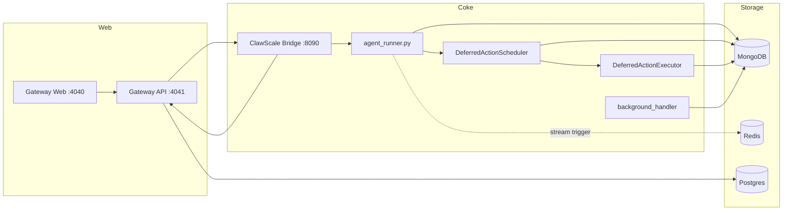

# Architecture Reference

This document describes the current ClawScale-only runtime wired in this repository.

## 1. Runtime Topology

The production stack consists of:

- `agent/runner/agent_runner.py`
  - runs Coke message workers
  - boots the deferred-action scheduler
  - runs background maintenance jobs
- `agent/runner/deferred_action_scheduler.py`
  - rebuilds APScheduler jobs from MongoDB state
  - reconciles expired leases on startup
- `agent/runner/deferred_action_executor.py`
  - claims due actions
  - acquires the normal conversation lock boundary
  - routes triggered actions through `handle_message()`
- `connector/clawscale_bridge/app.py`
  - handles user auth, bind flow, and Coke-specific bridge APIs
  - dispatches outbound replies to the gateway
- `gateway/`
  - serves the web UI on `4040`
  - serves the API on `4041`
- data services
  - MongoDB for Coke runtime state, including `deferred_actions` and
    `deferred_action_occurrences`
  - Redis for stream wake-up / trigger events
  - Postgres for gateway state



## 2. Inbound Path

Current inbound traffic comes through ClawScale:

```text
user channel
  -> gateway
  -> bridge /bridge/inbound
  -> MongoDB inputmessages
  -> optional Redis XADD
  -> agent workers
```

Key points:

- `connector/clawscale_bridge/app.py` validates bridge requests and converts them into Coke input documents.
- `util/redis_stream.py` is only a wake-up path; MongoDB remains the source of truth.
- `agent/runner/message_processor.py` still acquires work from `inputmessages` and conversation locks in MongoDB.

## 3. Worker Runtime

`agent/runner/agent_runner.py` now has three responsibilities:

1. run N message workers
2. boot one in-process deferred-action scheduler/executor runtime
3. run the background handler loop

Each worker:

1. checks queue mode
2. optionally drains Redis stream triggers
3. executes the shared handler from `create_handler(worker_id)`

`agent/runner/message_processor.py` still handles:

- message acquisition
- conversation locking
- batching pending messages for the same conversation
- final status updates

The deferred-action runtime now owns all reminder and proactive follow-up
triggering:

- `deferred_actions` stores business state, recurrence, `next_run_at`, and
  visibility
- `deferred_action_occurrences` stores per-occurrence claim/success/failure
  audit
- APScheduler holds only the next concrete in-process wake-up for each active
  action
- `agent_background_handler.py` no longer polls legacy reminder or future
  queues

## 4. Turn Processing Pipeline

The shared turn pipeline remains:

1. `PrepareWorkflow`
2. `StreamingChatWorkflow`
3. `PostAnalyzeWorkflow`

This path is invoked from `agent/runner/agent_handler.py` for both normal user
turns and deferred-action-triggered turns (`message_source="deferred_action"`).

## 5. Outbound Path

Outbound replies now follow:

```text
agent outputmessages
  -> bridge output dispatcher
  -> gateway /api/outbound
  -> ClawScale-managed delivery route
```

This means the Coke repository no longer owns any direct platform connector runtime.

## 6. Deployment Topology

The checked-in production deployment matches the runtime above:

- `docker-compose.prod.yml`
- host Nginx reverse proxy
- `deploy/systemd/coke-compose.service`

The active services are:

- `mongo`
- `redis`
- `postgres`
- `coke-agent`
- `coke-bridge`
- `gateway`
