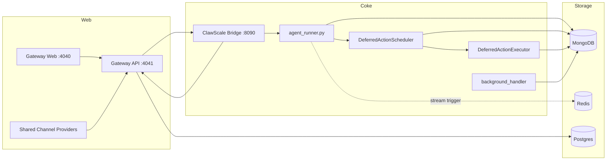

# Architecture Reference

This document describes the current ClawScale-backed runtime wired in this
repository, including the gateway-owned shared-channel experiments that feed
the same Coke worker pipeline.

## 1. Runtime Topology

The production stack consists of:

- `agent/runner/agent_runner.py`
  - runs Coke message workers
  - boots the deferred-action scheduler
  - runs background maintenance jobs
- `agent/runner/deferred_action_scheduler.py`
  - rebuilds APScheduler jobs from MongoDB state
  - reconciles expired leases on startup
- `agent/runner/deferred_action_executor.py`
  - claims due actions
  - acquires the normal conversation lock boundary
  - routes triggered actions through `handle_message()`
- `connector/clawscale_bridge/app.py`
  - handles user auth, bind flow, and Coke-specific bridge APIs
  - dispatches outbound replies to the gateway
- `gateway/`
  - serves the web UI on `4040`
  - serves the API on `4041`
  - owns shared-channel admin/config state and provider webhook routes for the
    active `whatsapp_evolution`, `wechat_ecloud`, and `linq` experiments
- data services
  - MongoDB for Coke runtime state, including `deferred_actions` and
    `deferred_action_occurrences`
  - Redis for stream wake-up / trigger events
  - Postgres for gateway state



## 2. Inbound Path

Current personal-channel inbound traffic comes through ClawScale:

```text
user channel
  -> gateway
  -> bridge /bridge/inbound
  -> MongoDB inputmessages
  -> optional Redis XADD
  -> agent workers
```

Active shared-channel experiments enter through provider-specific gateway
webhook routes before converging on the same Coke bridge and worker runtime:

```text
provider webhook
  -> gateway /gateway/evolution/whatsapp | /gateway/ecloud/wechat | /gateway/linq
  -> shared-channel provisioning and route binding
  -> bridge /bridge/inbound
  -> MongoDB inputmessages
  -> optional Redis XADD
  -> agent workers
```

Key points:

- `connector/clawscale_bridge/app.py` validates bridge requests and converts them into Coke input documents.
- `gateway/packages/api/src/gateway/message-router.ts` owns provider webhook
  normalization for active shared-channel experiments.
- `gateway/packages/api/src/lib/route-message.ts` and shared-channel
  provisioning map external senders onto Coke customers and delivery routes
  before handing messages to the bridge.
- `util/redis_stream.py` is only a wake-up path; MongoDB remains the source of truth.
- `agent/runner/message_processor.py` still acquires work from `inputmessages` and conversation locks in MongoDB.

## 3. Worker Runtime

`agent/runner/agent_runner.py` now has three responsibilities:

1. run N message workers
2. boot one in-process deferred-action scheduler/executor runtime
3. run the background handler loop

Each worker:

1. checks queue mode
2. optionally drains Redis stream triggers
3. executes the shared handler from `create_handler(worker_id)`

`agent/runner/message_processor.py` still handles:

- message acquisition
- conversation locking
- batching pending messages for the same conversation
- final status updates

The deferred-action runtime now owns all reminder and proactive follow-up
triggering:

- `deferred_actions` stores business state, recurrence, `next_run_at`, and
  visibility
- `deferred_action_occurrences` stores per-occurrence claim/success/failure
  audit
- APScheduler holds only the next concrete in-process wake-up for each active
  action
- no live runtime path depends on `conversation_info.future`
- `agent_background_handler.py` no longer polls legacy reminder or future
  queues
- `scripts/retire_legacy_reminder_compat.py` is the one-time operational
  cleanup path that unsets retired conversation compatibility fields and
  archives the legacy `reminders` collection to a timestamped backup name

## 4. Turn Processing Pipeline

The shared turn pipeline remains:

1. `PrepareWorkflow`
2. `StreamingChatWorkflow`
3. `PostAnalyzeWorkflow`

This path is invoked from `agent/runner/agent_handler.py` for both normal user
turns and deferred-action-triggered turns (`message_source="deferred_action"`).

## 5. Outbound Path

Outbound replies now follow:

```text
agent outputmessages
  -> bridge output dispatcher
  -> gateway /api/outbound
  -> delivery route
  -> ClawScale-managed personal route or shared-channel provider route
```

For personal `wechat_personal`, delivery is ClawScale-backed. For active
shared-channel experiments, gateway dispatches through the provider-specific
delivery branch for `whatsapp_evolution`, `wechat_ecloud`, or `linq`. Retired
Coke-owned direct channel runtimes should not be reintroduced for the personal
onboarding path.

## 6. Shared-Channel Boundary

Shared channels are active gateway-owned experiments, not the primary personal
onboarding path.

Runtime ownership is split as follows:

- `gateway/`
  - owns shared-channel admin/config state
  - owns provider webhook verification and normalization
  - owns shared-customer provisioning and delivery-route binding
  - owns provider-specific outbound delivery through `/api/outbound`
- `connector/clawscale_bridge/`
  - remains the boundary that converts normalized inbound events into Coke
    `inputmessages`
  - dispatches Coke `outputmessages` back to the gateway
- worker runtime
  - treats shared-channel turns like normal Coke turns after the bridge handoff

Current active shared-channel kinds:

- `whatsapp_evolution`
- `wechat_ecloud`
- `linq`

## 7. Google Calendar Import Boundary

The first-version Google Calendar import flow is a one-time migration for a
claimed customer's `primary` calendar. Imported events become Coke-owned
reminders, and historical imports are written as completed records so they do
not schedule future work.

Runtime ownership is split as follows:

- `gateway/`
  - owns claim-entry
  - owns Google OAuth and callback handling
  - owns Postgres audit state for import runs
  - serves the customer-facing web/API flow
- `connector/clawscale_bridge/`
  - resolves the target Coke conversation for an import
  - exposes the internal preflight and import routes that hand work into the
    worker/runtime reminder path

## 8. Deployment Topology

The checked-in production deployment matches the runtime above:

- `docker-compose.prod.yml`
- host Nginx reverse proxy
- `deploy/systemd/coke-compose.service`

The active services are:

- `mongo`
- `redis`
- `postgres`
- `coke-agent`
- `coke-bridge`
- `gateway`
