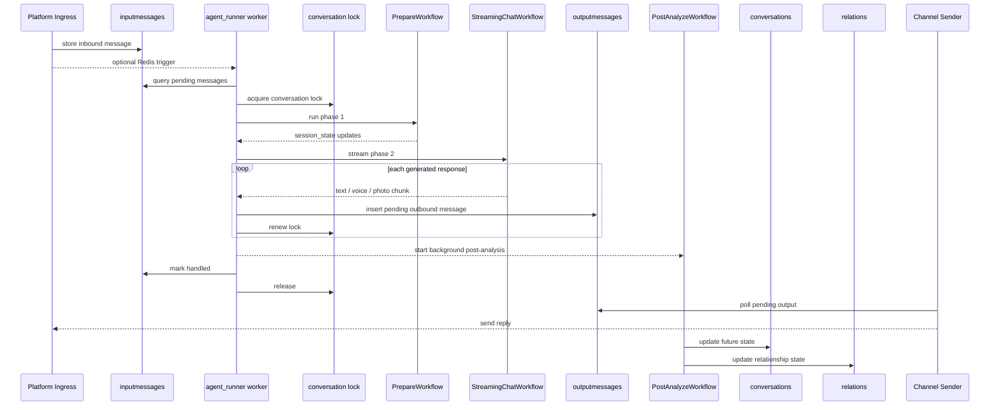

# Architecture Reference

This document describes the current runtime architecture implemented in code. It focuses on the paths that are actually wired today, then calls out the newer channel abstraction layer that exists in the repository but is not yet the single runtime entrypoint.

## 1. Runtime Topology

The system currently runs as a small set of cooperating processes:

- `agent/runner/agent_runner.py`
  - starts the main message workers
  - runs background jobs
  - starts the WhatsApp webhook server and WhatsApp outbound sender
- `connector/ecloud/ecloud_input.py`
  - receives WeChat/Ecloud webhook traffic
  - normalizes and stores inbound messages
- `connector/ecloud/ecloud_output.py`
  - polls `outputmessages`
  - sends WeChat replies back through Ecloud

The default startup path in [`start.sh`](/data/projects/coke/start.sh) launches both the runner side and the Ecloud side. [`agent/runner/agent_start.sh`](/data/projects/coke/agent/runner/agent_start.sh) starts `agent_runner.py`; [`connector/ecloud/ecloud_start.sh`](/data/projects/coke/connector/ecloud/ecloud_start.sh) starts the Ecloud input/output processes.

### Component Diagram

```mermaid
flowchart LR
    subgraph Platforms
        WC[WeChat via Ecloud]
        WA[WhatsApp]
        TERM[Terminal / Test Tools]
    end

    subgraph Ingress
        EI[connector/ecloud/ecloud_input.py]
        WEBHOOK[WebhookServer in agent_runner.py]
        TTOOLS[terminal_chat.py / terminal_test_client.py]
    end

    subgraph Storage
        IM[(MongoDB inputmessages)]
        OM[(MongoDB outputmessages)]
        CONV[(MongoDB conversations)]
        REL[(MongoDB relations)]
        REM[(MongoDB reminders)]
        LOCKS[(MongoDB locks)]
        REDIS[(Redis coke:input)]
    end

    subgraph Runtime
        RUNNER[agent/runner/agent_runner.py]
        HANDLER[create_handler() / handle_message()]
        BG[agent_background_handler.py]
        PREP[PrepareWorkflow]
        CHAT[StreamingChatWorkflow]
        POST[PostAnalyzeWorkflow]
    end

    subgraph Outbound
        EO[connector/ecloud/ecloud_output.py]
        WAOUT[whatsapp_output_handler()]
    end

    WC --> EI
    WA --> WEBHOOK
    TERM --> TTOOLS

    EI --> IM
    WEBHOOK --> IM
    TTOOLS --> IM

    EI -. optional trigger .-> REDIS
    WEBHOOK -. optional trigger .-> REDIS

    RUNNER --> HANDLER
    RUNNER --> BG
    REDIS -. wake-up / ack .-> RUNNER
    IM --> HANDLER
    HANDLER --> LOCKS
    HANDLER --> PREP --> CHAT --> OM
    HANDLER -. background .-> POST
    POST --> CONV
    POST --> REL
    BG --> REM
    BG --> CONV
    BG --> HANDLER

    OM --> EO --> WC
    OM --> WAOUT --> WA
```

## 2. Active Inbound Paths

All active inbound paths converge on MongoDB `inputmessages`. Redis is optional and acts as a wake-up/trigger mechanism, not the source of truth for message contents.

### WeChat via Ecloud

Flow:

```text
Ecloud webhook
  -> connector/ecloud/ecloud_input.py
  -> normalize message / validate user + character / group reply policy
  -> insert into MongoDB inputmessages
  -> optional Redis XADD to coke:input
```

Key details:

- `connector/ecloud/ecloud_input.py` is a Flask app served by Gunicorn.
- It validates supported message types and group reply rules.
- It resolves or creates the sender in `users`.
- It stores normalized messages into `inputmessages`.
- If Redis is available, it publishes an event to `coke:input`.

### WhatsApp via Webhook

Flow:

```text
WhatsApp webhook
  -> WebhookServer inside agent/runner/agent_runner.py
  -> webhook adapter parses payload
  -> save_whatsapp_message()
  -> insert into MongoDB inputmessages
  -> optional Redis XADD to coke:input
```

Key details:

- The webhook server is started directly inside [`agent/runner/agent_runner.py`](/data/projects/coke/agent/runner/agent_runner.py).
- It uses [`connector/adapters/whatsapp/webhook_server.py`](/data/projects/coke/connector/adapters/whatsapp/webhook_server.py) plus either the Evolution or Cloud API adapter, depending on config.
- Incoming platform IDs are mapped into MongoDB `users`; missing users may be auto-created.

### Terminal and Test Tools

Local tooling writes straight to MongoDB:

- [`connector/terminal/terminal_chat.py`](/data/projects/coke/connector/terminal/terminal_chat.py)
- [`connector/terminal/terminal_test_client.py`](/data/projects/coke/connector/terminal/terminal_test_client.py)

These are development/test entrypoints, not the main production ingress.

## 3. Queue And Message Acquisition

### Source of Truth

`inputmessages` is the canonical inbound queue. Workers always process by querying MongoDB documents.

### Optional Redis Trigger

Redis stream support is present, but the current implementation is narrower than the old document implied:

- `util/redis_stream.py` publishes lightweight events to `coke:input`
- `agent/runner/message_processor.py::consume_stream_batch()` reads and acknowledges stream entries
- the worker still fetches the real message payload from MongoDB via `inputmessages`

So even in Redis mode, the stream is a trigger/ack path; MongoDB remains the business queue.

### Queue Mode

`agent/runner/message_processor.py::get_queue_mode()` reads `CONF.get("queue_mode", "poll")`.

In the current checked-in config, `queue_mode` is not set in [`conf/config.json`](/data/projects/coke/conf/config.json), so the effective default is:

- `poll`

That means the normal runtime path is Mongo polling. Redis mode is optional.

## 4. Worker Runtime

### Main Loop

Each worker in [`agent/runner/agent_runner.py`](/data/projects/coke/agent/runner/agent_runner.py):

1. decides queue mode
2. optionally drains/acks Redis stream events
3. runs a handler returned by `create_handler(worker_id)`

### Message Acquisition

[`agent/runner/message_processor.py`](/data/projects/coke/agent/runner/message_processor.py) splits the worker logic into three parts:

- `MessageAcquirer`
- `MessageDispatcher`
- `MessageFinalizer`

`MessageAcquirer` currently:

1. resolves the active character from `default_character_alias`
2. reads up to 16 pending `inputmessages` for that character
3. validates the message platform against user/character platform bindings
4. gets or creates the corresponding `conversations` document
5. acquires a MongoDB conversation lock
6. loads all pending input messages for the same user/character/platform pair

Locks are stored in MongoDB via [`dao/lock.py`](/data/projects/coke/dao/lock.py) with `resource_type="conversation"`.

### Dispatch Decisions Before LLM

`MessageDispatcher` can divert the turn before workflow execution:

- blocked user: `relation.relationship.dislike >= 100`
- access gate denial or expiration: subscription/paywall flow from [`agent/runner/access_gate.py`](/data/projects/coke/agent/runner/access_gate.py)
- admin hard commands
- busy character: input is moved to `hold`
- normal message: continue into workflows

## 5. Turn Processing Pipeline

The core turn path lives in [`agent/runner/agent_handler.py`](/data/projects/coke/agent/runner/agent_handler.py) and is reused by:

- normal user messages
- reminder-triggered system messages
- proactive/future system messages

`handle_message()` is the shared entrypoint.

### User Turn Sequence



### Phase 0: Context Preparation

Before the workflow phases, `context_prepare()` in [`agent/runner/context.py`](/data/projects/coke/agent/runner/context.py):

- builds `session_state`
- resolves user timezone
- loads or creates `relations`
- ensures `conversation_info` defaults exist
- prepares `chat_history_str` and `input_messages_str`
- injects group-chat context when applicable
- injects character prompt overrides from files
- detects repeated user input and builds anti-repeat hints

### Phase 1: PrepareWorkflow

[`agent/agno_agent/workflows/prepare_workflow.py`](/data/projects/coke/agent/agno_agent/workflows/prepare_workflow.py)

Current behavior:

1. run `orchestrator_agent`
2. optionally run `context_retrieve_tool`
3. optionally run `web_search_tool`
4. optionally update timezone
5. extract URL content
6. optionally run `reminder_detect_agent`

Important runtime rules:

- `message_source` is propagated in `session_state`
- system-generated messages (`reminder`, `future`) skip reminder detection
- prepare phase writes its decisions into `session_state["orchestrator"]`, `session_state["context_retrieve"]`, `session_state["web_search_result"]`, and related fields

### Phase 2: StreamingChatWorkflow

[`agent/agno_agent/workflows/chat_workflow_streaming.py`](/data/projects/coke/agent/agno_agent/workflows/chat_workflow_streaming.py)

Current behavior:

- uses a streaming Agno `Agent`
- chooses prompt structure based on `message_source`
- yields message fragments as multimodal units (`text`, `voice`, `photo`)
- injects optional context such as:
  - reminders
  - retrieved history
  - web search results
  - URL understanding results
  - onboarding hints
  - anti-repeat hints

Generated messages are persisted immediately through `send_message_via_context()` in [`agent/util/message_util.py`](/data/projects/coke/agent/util/message_util.py), which inserts documents into `outputmessages`.

### Rollback And Lock Handling During Streaming

While streaming:

- the conversation lock is renewed before Phase 2, during sends, and before Phase 3
- user-message processing checks whether a newer pending input arrived
- if a new input arrives, the current turn can rollback
- already-sent partial outputs are recorded into chat history to avoid duplicate re-send

### Phase 3: PostAnalyzeWorkflow

[`agent/agno_agent/workflows/post_analyze_workflow.py`](/data/projects/coke/agent/agno_agent/workflows/post_analyze_workflow.py)

Current behavior differs from the old document:

- for normal user messages and proactive messages, PostAnalyze is usually launched in the background with `asyncio.create_task(...)`
- for reminder messages, the expensive LLM post-analysis is skipped
- `SKIP_POST_ANALYZE=1` can disable this phase for tests

PostAnalyze is responsible for:

- updating relationship deltas
- updating user/character memory fields
- maintaining `conversation_info.future`

The background completion path writes:

- `relations`
- `conversations.conversation_info.future`

## 6. Finalization And Persistence

After `handle_message()` returns, `MessageFinalizer` commits the turn outcome.

### Success Path

On success it:

- appends input messages to `conversation_info.chat_history`
- appends response messages to `conversation_info.chat_history`
- trims history
- clears `turn_sent_contents`
- updates `conversations`
- updates `relations`
- marks processed `inputmessages` as `handled`
- asynchronously stores embeddings for later retrieval

### Rollback Path

On rollback it:

- increments `rollback_count`
- records already-sent output into chat history
- records `turn_sent_contents` for deduplication on the retry turn

### Error Path

On error it:

- increments `retry_count`
- stores a truncated `last_error`
- eventually marks the input as `failed` after max retries

### Hold Path

If the character is busy, input messages are marked `hold`.

`agent/runner/agent_background_handler.py` periodically checks hold messages and moves them back to `pending` when:

- the hold timeout expires
- the character status becomes idle again

## 7. System-Generated Message Paths

The runtime does not only process user input. Background tasks can synthesize turns and route them through the same `handle_message()` pipeline.

### Proactive/Future Messages

Background flow:

1. `handle_proactive_message()` decides whether to schedule a future proactive action
2. it writes `conversation_info.future`
3. `handle_pending_future_message()` finds due future actions
4. it acquires the conversation lock
5. it marks `conversation_info.future.status = "processing"`
6. it calls `handle_message(..., message_source="future")`
7. it updates chat history and relation
8. it clears or replaces `conversation_info.future` atomically

Important notes:

- future actions are stored on the conversation, not in `inputmessages`
- execution still reuses the same workflow stack as a normal turn
- duplicate proactive messages are mitigated using recent character output checks

### Reminder Messages

Reminder flow in [`agent/runner/agent_background_handler.py`](/data/projects/coke/agent/runner/agent_background_handler.py):

1. load due reminders through `ReminderDAO.find_pending_reminders(...)`
2. look ahead by 180 seconds to group near-future reminders
3. group reminders by conversation and trigger window
4. acquire the same conversation lock used by normal turns
5. build a synthetic system message
6. call `handle_message(..., message_source="reminder")`
7. update reminder lifecycle state

Current reminder lifecycle behavior:

- due reminders are discovered from `status="active"`
- once sent, a reminder is marked `triggered`
- one-time reminders are then marked `completed`
- recurring reminders are rescheduled back to `active`
- invalid/unresolvable reminders may be completed or cancelled to avoid infinite retries

## 8. Outbound Delivery

`outputmessages` is the outbound queue. Each channel has its own sender loop today.

### WeChat Outbound

[`connector/ecloud/ecloud_output.py`](/data/projects/coke/connector/ecloud/ecloud_output.py) polls:

- `platform = "wechat"`
- `status = "pending"`
- `expect_output_timestamp <= now`

It then sends through Ecloud APIs and updates `outputmessages.status` to `handled` or `failed`.

### WhatsApp Outbound

[`agent/runner/agent_runner.py`](/data/projects/coke/agent/runner/agent_runner.py) contains a dedicated `whatsapp_output_handler(adapter)` loop that:

- polls pending WhatsApp `outputmessages`
- resolves the target user/chat
- sends with the configured adapter
- marks each outbound message `handled` or `failed`

### Terminal Outbound

Terminal tools read `outputmessages` directly for local debugging and E2E testing.

## 9. Data Model In Practice

The most important runtime collections are:

- `inputmessages`: inbound queue and retry/hold state
- `outputmessages`: outbound queue
- `conversations`: long-lived conversation state and `conversation_info.future`
- `relations`: user-character relationship state
- `reminders`: reminder lifecycle and schedules
- `users`: people and characters with per-platform identities
- `locks`: per-conversation distributed locks
- `embeddings`: semantic retrieval storage
- `usage_records`: workflow token/runtime accounting
- `dailynews`: contextual daily content loaded during context prep
- `dailyscripts`: proactive message timing window lookup

## 10. Status And Concurrency Model

### `inputmessages.status`

- `pending`: waiting for worker pickup
- `handled`: fully processed
- `failed`: gave up after retry budget or hard failure
- `hold`: temporarily paused because the character is busy

Additional control fields used by the current code include:

- `retry_count`
- `rollback_count`
- `hold_started_at`
- `last_error`

### `outputmessages.status`

- `pending`
- `handled`
- `failed`

### Reminder Statuses

Statuses actively used by the current reminder code include:

- `active`
- `triggered`
- `completed`
- `cancelled`

### Conversation Locking

All main turn types share the same MongoDB conversation lock:

- user turns
- proactive/future turns
- reminder turns

This is the main concurrency boundary in the system.

## 11. Implemented But Not Yet The Primary Runtime Path

The repository contains a newer channel abstraction layer:

- [`connector/channel/adapter.py`](/data/projects/coke/connector/channel/adapter.py)
- [`connector/channel/polling_adapter.py`](/data/projects/coke/connector/channel/polling_adapter.py)
- [`connector/channel/gateway_adapter.py`](/data/projects/coke/connector/channel/gateway_adapter.py)
- [`connector/channel/webhook_adapter.py`](/data/projects/coke/connector/channel/webhook_adapter.py)
- [`connector/channel/registry.py`](/data/projects/coke/connector/channel/registry.py)
- [`connector/gateway/server.py`](/data/projects/coke/connector/gateway/server.py)

Platform adapters also exist under `connector/adapters/`, including Telegram, Discord, WhatsApp, Ecloud, and Terminal adapters.

However, the current runtime is still mixed:

- WeChat is still driven by the legacy Ecloud input/output processes
- WhatsApp is wired directly inside `agent_runner.py` with the webhook server
- the generic `GatewayServer` is implemented but is not the single production ingress/orchestration point
- the adapter abstraction is better understood as a migration surface and extension layer than as the only runtime architecture today

## 12. Practical Summary

If you are debugging a live message path today, the shortest accurate mental model is:

```text
Platform-specific ingress
  -> normalize / resolve users
  -> MongoDB inputmessages
  -> worker acquires conversation lock
  -> PrepareWorkflow
  -> StreamingChatWorkflow
  -> outputmessages
  -> platform-specific sender
  -> optional background PostAnalyze update
```

For system-triggered actions, replace the first two steps with:

- reminder scheduler, or
- conversation future/proactive scheduler

and the rest of the pipeline stays the same.
