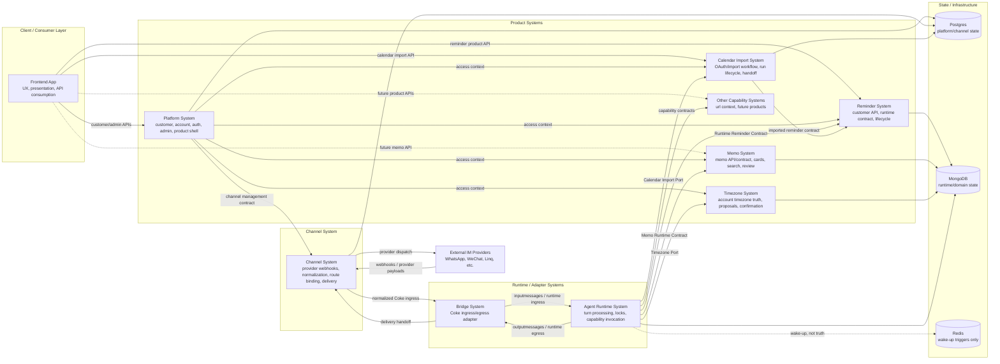
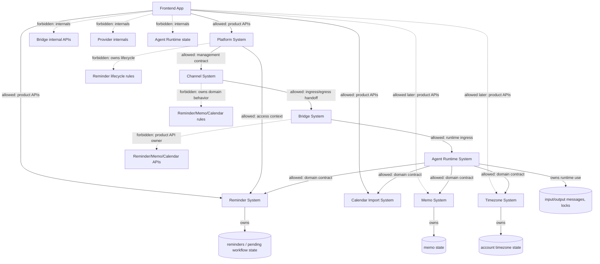

# Frontend Platform Channel Boundary Design

## Status

- **Date:** 2026-05-19
- **State:** Draft — human-review normative, CI-enforced only where this
  document explicitly names a landed guardrail. No service/process split or
  existing directory rename; the `gateway/packages/shared` package boundary
  split is the one explicit code-organization prerequisite.
- **Intended consumers:** future PRs touching `gateway/`, `agent/`,
  `connector/clawscale_bridge/`, and any new product surface (Reminder,
  Memo, future capabilities).
- **Exit criteria for promotion out of Draft:**
  1. `docs/design-docs/interface-contract.md`,
     `docs/product-specs/FEATURE_TREE.md`, and `docs/ARCHITECTURE.md` have
     been reconciled with the ownership and route classifications here.
  2. This doc is referenced from
     `docs/design-docs/coke-working-contract.md`.
  3. [Contract Catalog](#contract-catalog) is current — every named
     contract has a row, no rows reference paths that no longer exist.
  4. The complete plan package in
     `docs/superpowers/plans/2026-05-19-frontend-platform-channel-boundary-plan-package.md`
     has landed, and each [Follow-up Work Item](#follow-up-work-items) is
     either resolved or has a landed plan in `docs/superpowers/plans/`.
  5. [Hard Prerequisites](#hard-prerequisites) are met (shared-package
     split has landed, with an import-boundary guardrail).
  6. No promoted section contains open-ended text for contract location, data
     retention, or enforcement status. Any remaining work must be captured in
     [Follow-up Work Items](#follow-up-work-items) with an owner and plan path.
- **Normative location:** the per-system **Boundary Rule** blocks are
  normative. Diagrams, "Allowed Interaction Summary," "First-Pass Module
  Interaction," and "Initial Review Rules" are illustrative restatements;
  if any of them conflict with a Boundary Rule, the Boundary Rule wins.

## Enforceability Levels

The spec uses three enforcement levels. Each Boundary Rule should be read at
the level named in that section or in the prerequisite that governs it.

| Level | Meaning | Blocks PRs? |
| --- | --- | --- |
| Advisory | Desired direction before code support exists | No, but reviewers should comment |
| Review-blocking | Boundary is explicit enough for human review | Yes, unless the PR documents a waiver |
| CI-blocking | Guardrail exists in `scripts/check`, lint, tests, or CI | Yes |

Promotion out of Draft requires every review-blocking rule to have either a
matching CI-blocking guardrail or a linked follow-up plan that names the
missing guardrail.

Unless a section says otherwise, Boundary Rules are **review-blocking**.
Rules that depend on a [Hard Prerequisite](#hard-prerequisites) remain
**advisory** until that prerequisite lands, then become **CI-blocking** when
the named guardrail is wired into verification.

## Goal

Define the first architecture-module cut by separating concepts that are
currently easy to treat as one system. The first group covers the current
`gateway/` area:

- Frontend App
- Platform System
- Channel System

The second group covers the backend runtime path:

- Reminder System
- Memo System
- Calendar Import System
- Timezone System
- Other Capability Systems
- Bridge System
- Agent Runtime System
- State and Infrastructure System

This document is intentionally about architecture ownership, not physical
service extraction. The systems may continue to share the current monorepo,
runtime process, and deployment unit while their boundaries are made explicit.

## Context

Current code places the customer/admin web app, platform APIs, channel ingress,
provider adapters, outbound delivery, shared channel types, and some
customer-facing product APIs under `gateway/`.

That directory shape makes development convenient, but it hides distinct
ownership boundaries. The risk is that future work treats `gateway` as a
single architecture module and keeps coupling UI, platform account concerns,
provider behavior, and product-domain behavior together.

The boundary problem is not only "frontend and backend are not separated."
The deeper problem is that the frontend is not consistently modeled as an API
consumer, and the backend side mixes platform ownership with external IM
channel ownership.

## Relationship to Existing Canonical Docs

This spec adds an **ownership** axis. It does not replace the **planning
surface** axis defined in
[`coke-working-contract.md`](../../design-docs/coke-working-contract.md).

- Planning surfaces (`worker-runtime`, `bridge`, `gateway-api`,
  `gateway-web`, `deploy`, `repo-os`) describe **where verification runs and
  who reviews a change** — they map to directories and CI surfaces.
- Ownership systems in this doc (Frontend, Platform, Channel, Reminder,
  Memo, Calendar Import, Timezone, Other Capability, Bridge, Agent Runtime,
  State) describe **who owns the truth and the contract** for a behavior,
  independent of where its current files live.

A single change can touch one planning surface (for example `gateway-api`)
while affecting multiple ownership systems (Platform + Channel + Reminder).
[Initial Review Rules](#initial-review-rules) classify changes by
ownership; planning surfaces still drive verification routing via
`zsh scripts/suggest-verification --base HEAD~1`.

This spec also assumes the
[Agent Capability Contract](../../design-docs/agent-capability-contract.md)
rule: every agent-facing capability exposes a domain contract, and adapters
(Agno tools, HTTP routes, MCP, CLI, web) call that contract rather than
owning behavior. The "Runtime Reminder Contract," "Memo Runtime Contract,"
Calendar Import contracts, and the contracts under Other Capability Systems
are concrete instances of that rule and should be reviewed against it.

## Hard Prerequisites

These items must land before the affected Boundary Rules become CI-blocking.
Until then they are advisory — reviewers should call them out and should block
only when a PR adds new coupling beyond the current known leak.

### `gateway/packages/shared` frontend/backend split

`gateway/packages/shared/src/types/channel.ts` mixes frontend-safe status
and display types with provider config schemas in a package importable
from both `web` and `api`. The Boundary Rules for
[Frontend App](#system-1-frontend-app) ("Frontend App must not consume
backend internals") and [Channel System](#system-3-channel-system)
("Channel provider logic should stay behind Channel contracts") are not
machine-enforceable until this package is split.

- **Owner:** Channel System owns provider-internal schemas. The system that
  exposes a frontend-safe API owns that API's DTOs. Frontend App consumes
  those DTOs but does not own their truth.
- **Target:** before any new provider field is added to the current
  shared channel types. No new provider-only fields land in the
  combined package in the meantime.
- **Status:** Landed by
  `docs/superpowers/plans/2026-05-19-shared-channel-package-boundary.md`;
  evidence is under
  `artifacts/evidence/2026-05-19-frontend-platform-channel-boundary/shared-channel-package-boundary/`.
- **Done when:** `packages/web` imports only contract DTOs from a
  frontend-safe contract package; provider config and secret-bearing schemas
  live in a backend-only package; and CI forbids frontend imports from
  backend-only paths.

Once this lands, the Boundary Rules for Systems 1 and 3 become
enforceable in CI, not just in human review.

## Design Principle

Frontend owns experience, not business truth.

Platform owns customer, account, auth, admin, and product-shell concerns.

Channel owns external IM/provider integration, routing, and delivery.

Product systems such as Reminder, Memo, Calendar Import, and Timezone should
expose product-facing APIs or contracts that the frontend and runtime can
consume without depending on internal storage or provider details.

Reminder owns reminder truth.

Memo owns memo truth.

Calendar Import owns Google Calendar import truth.

Timezone owns account-level timezone truth.

Agent Runtime consumes Reminder contracts.

Bridge adapts Coke ingress and egress only.

State stores are infrastructure; collections and tables must still have
product or runtime owners.

## Contract Direction

Do not model this architecture as one total order. Model it as consumers
calling owned contracts. The forbidden case is not "leftward" movement; it is
bypassing the system that owns the behavior.

```text
Frontend App -> Platform / Reminder / Calendar Import / future product HTTP contracts
External IM Providers -> Channel webhook contracts
Platform -> Channel management contracts and product access context
Channel -> Bridge ingress / outbound handoff contracts
Bridge -> Agent Runtime ingress and output contracts
Agent Runtime -> Reminder / Memo / Timezone / capability runtime contracts
All systems -> their owned state only
```

Exceptions:

- Reminder System may emit reminder-fired events consumed by Agent Runtime.
  Events are contract calls only when the emitter knows a consumer-specific
  implementation. The current target is emitter-owned event shape and
  consumer-owned handling.
- Platform may provide read-only access context to product systems. That is
  context propagation, not downstream ownership of Platform behavior.
- Bridge and Agent Runtime have a bidirectional protocol flow for ingress,
  output, sync replies, and late reply promotion. The boundary is the Bridge
  protocol contract, not a one-way import rule.

The rule is: **if A needs B's behavior, A calls B's named contract.** Direct
imports into another system's storage, provider adapter, route body, or
runtime internals are boundary violations even when the file path is
convenient.

## Target System Map

This map shows architecture ownership, not required process or repository
layout.



## Target Module List

The first architecture cut contains these ownership systems:

| System | Primary responsibility | Not responsible for |
| --- | --- | --- |
| Frontend App | UX, presentation, view models, API consumption | Business truth, provider semantics, runtime state |
| Platform System | Customer/account/auth/admin/product shell | Provider protocols, product lifecycle truth |
| Channel System | External IM integration, routing, delivery | Product domain behavior, frontend presentation |
| Reminder System | Reminder API, runtime contract, lifecycle, schedule | Worker lifecycle, provider dispatch, platform account truth |
| Memo System | Memo contract/API, memo cards, search, review, proposals | Worker lifecycle, frontend implementation, provider dispatch |
| Calendar Import System | Google Calendar OAuth/import workflow, import runs, dedupe, handoff | Platform auth truth, generic turn execution, provider channel dispatch |
| Timezone System | Account timezone truth, timezone source/status, pending timezone proposals | Reminder lifecycle, generic turn execution, channel provider metadata |
| Other Capability Systems | Capability-specific contracts for URL context and future products | Generic turn execution, platform shell, channel provider logic |
| Bridge System | Coke ingress/egress protocol adaptation | Product APIs, lifecycle rules, provider implementation |
| Agent Runtime System | Turn processing, locks, batching, capability invocation | Product API ownership, provider semantics, product lifecycle truth |
| State and Infrastructure System | Storage engines, wake-up plumbing, deployment/config substrate | Owning product meaning without a product/runtime owner |

## Allowed Interaction Summary



## Contract Catalog

Every system boundary above is realized by at least one named contract.
Adding a new agent-facing or cross-system capability means adding a row
here. Stale rows are a signal that this spec needs an update before the
next ownership change.

| Contract | Owner | Status | Shape | Location | Auth / scope | Idempotency | Verification |
| --- | --- | --- | --- | --- | --- | --- | --- |
| Runtime Reminder Contract | Reminder System | current | In-process Python | `agent/reminder/runtime_contract.py` | owner/customer context | operation-specific | focused reminder-system commands |
| Reminder Customer API | Reminder System | current | HTTP (`/api/customer/reminders`) | `gateway/packages/api/src/routes/customer-reminder-routes.ts` | customer session | mutation-specific | customer reminder web management commands |
| Bridge Reminder Management Adapter | Reminder System, Bridge adapter | current | HTTP to Python service | `connector/clawscale_bridge/reminder_management_service.py` | bridge internal auth | operation-specific | bridge + reminder management tests |
| Memo Runtime Contract | Memo System | current | In-process Python | `memo-runtime/memo_runtime/contract.py` | owner context | operation-specific | memo-runtime contract/storage tests |
| Calendar Import Customer API | Calendar Import System | current | HTTP (`/api/customer/google-calendar-import`, `/api/customer/calendar-import-handoffs`) | `gateway/packages/api/src/routes/customer-google-calendar-import-routes.ts`, `gateway/packages/api/src/routes/customer-google-calendar-import-callback-routes.ts`, `gateway/packages/api/src/routes/calendar-import-handoff-routes.ts` | customer session or tokenized handoff | import-run specific | Gateway Calendar Import commands |
| Calendar Import Agent Capability | Calendar Import System | current | In-process Python port + handoff HTTP call | `agent/agno_agent/capabilities/calendar_import_port.py`, `agent/agno_agent/tools/calendar_import_handoff.py` | runtime context | handoff request specific | agent capability + handoff route tests |
| Calendar Import Bridge Adapter | Calendar Import System, Bridge adapter | current | Python service | `connector/clawscale_bridge/google_calendar_import_service.py` | bridge/runtime context | import-run specific | Bridge Calendar Import Runtime commands |
| Timezone Runtime Contract | Timezone System | current | In-process Python service + port | `agent/timezone_service.py`, `agent/agno_agent/capabilities/timezone_port.py`, `agent/agno_agent/tools/timezone_tools.py` | account/runtime context | not applicable | timezone service/capability tests |
| URL Context Agent Capability | Other Capability Systems | current | In-process Python port | `agent/agno_agent/capabilities/url_context_port.py`, `agent/agno_agent/tools/url_reader.py` | runtime context | not applicable | agent capability tests |
| Channel Management Service | Channel System | planned | In-process TS service | backend-only Channel package created by the shared-package split | customer/admin access context | required for mutations | customer channel route tests |
| Bridge Ingress / Egress | Bridge System | current | HTTP + internal | `connector/clawscale_bridge/app.py`, `connector/clawscale_bridge/message_gateway.py` | bridge auth / trusted provider handoff | inbound event and output IDs | bridge baseline commands |
| Internal Gateway endpoints | Platform / Channel (per route) | current | HTTP (`/api/internal/*`) | `gateway/packages/api/src/routes/coke-bindings.ts`, `gateway/packages/api/src/routes/coke-delivery-routes.ts`, `gateway/packages/api/src/routes/coke-user-provision.ts` | internal API key | endpoint-specific | gateway API tests |
| Outbound Delivery Contract | Channel System | current | HTTP (`/api/outbound`) | `gateway/packages/api/src/routes/outbound.ts` | bridge/internal caller | required | outbound route tests |

No row may remain with a missing location after this spec is promoted out of
Draft. If the implementation is not ready, mark the row `planned` and link the
follow-up plan from [Follow-up Work Items](#follow-up-work-items).

Cross-references:

- `agent-capability-contract.md` is the design rule each row must meet.
- `interface-contract.md` governs HTTP namespaces (`/api/customer/*`,
  `/api/internal/*`, etc.) used by rows whose shape is HTTP.

## System 1: Frontend App

Frontend App is segmented by audience because boundary rules differ per
audience. Treat the audience as a sub-system during review.

| Sub-system | Audience | Allowed API namespaces | Must not consume |
| --- | --- | --- | --- |
| Customer App | Authenticated customer | `/api/customer/*`, `/api/auth/*`, Reminder and Calendar Import product APIs, future Memo product API | `/api/admin/*`, `/api/internal/*` |
| Admin App | Authenticated admin/operator | `/api/admin/*`, `/api/auth/*` | `/api/internal/*`, customer-private state |
| Public Landing | Unauthenticated visitor or token-bearer | `/api/public/*`, `/api/auth/*` (register/login/verify only) | All authenticated product APIs |

A single web bundle may host all three audiences, but ownership and
access boundaries should not be re-derived per file. A change that
crosses audiences (for example, surfacing customer-private data inside
an admin page) is a cross-audience change and must be reviewed against
both audience rules.

### Owns

- User interface composition.
- Page routing.
- Presentation and view models.
- Form state and local validation.
- Loading, error, and empty states.
- API client wrappers for product APIs.
- Light display-only transformations.

### Does Not Own

- Product lifecycle rules.
- Reminder recurrence or lifecycle truth.
- Channel provider semantics.
- Permission, account, billing, or entitlement truth.
- Runtime state machines.
- MongoDB, Postgres, or Redis schema meaning.
- Bridge internal APIs.
- Provider webhook or outbound delivery behavior.

### Current Concerns

`gateway/packages/web/lib/customer-reminders.ts` maps frontend repeat choices
to RRULE strings and back. That is acceptable only while it remains a form
adapter. It should not grow into reminder recurrence policy or lifecycle
behavior.

`gateway/packages/web/lib/customer-wechat-channel.ts` maps channel statuses to
view-model copy. That is acceptable display logic. The frontend should not
derive allowed channel actions, provider behavior, or lifecycle transitions
from those statuses.

Action availability must come from backend contracts. Frontend may
optimistically hide or disable controls for UX, but API responses should expose
allowed actions, blocked reasons, and the next recommended action for channel,
reminder, calendar import, and future product surfaces. Frontend copy may
explain those states; it must not be the source of allowed-transition truth.

### Boundary Rule

Frontend App may consume multiple product APIs:

```text
Frontend App
  -> Platform API
  -> Reminder API
  -> Calendar Import API
  -> future Memo API
```

Frontend App must not consume backend internals:

```text
Frontend App
  -/-> Bridge internal API
  -/-> provider webhook routes
  -/-> MongoDB runtime schema
  -/-> Channel provider config internals
  -/-> Agent Runtime state
```

## System 2: Platform System

### Owns

- Customer identity.
- Account lifecycle.
- Authentication and session context.
- Admin/customer management.
- Subscription and billing surfaces.
- Product-shell navigation and access context.
- Customer-safe APIs for account and product entry points.

### Does Not Own

- External IM provider protocols.
- Provider webhook normalization.
- Provider-specific outbound dispatch.
- Reminder lifecycle behavior.
- Agent turn processing.
- Runtime scheduling.
- Channel delivery implementation.

### Current Concerns

`gateway/packages/api/src/index.ts` mounts routes with several different
ownership models in one server entrypoint:

- internal integration routes for identity, delivery, user provisioning, and
  calendar-import handoffs
- customer auth, claim, subscription, channel, reminder, and calendar-import
  routes
- admin customer, shared-channel, delivery, and admin-management routes
- outbound route
- `/gateway` provider ingress route

Sharing one process is acceptable. Treating all of these routes as one
Platform System is not.

The Platform System can be the user-facing shell and access context, but it
should not become the permanent pass-through owner for every product domain or
channel concern.

### Boundary Rule

Platform System may:

- Authenticate the user/customer.
- Resolve account and customer context.
- Expose platform/customer/admin APIs.
- Coordinate access to product systems through explicit product APIs.
- Provide management entry points for channels.
- Expose customer-safe capability status and action-availability summaries for
  the product shell.

Platform System must not:

- Implement provider webhook logic.
- Own provider credentials beyond customer-safe management metadata.
- Implement reminder lifecycle decisions.
- Read or write product runtime state directly unless that state is explicitly
  owned by Platform.
- Turn into a generic facade that hides unclear ownership.

## System 3: Channel System

### Owns

- External IM/provider webhook handling.
- Provider payload normalization.
- Provider-specific credentials and config.
- Shared-channel provisioning.
- Channel binding.
- Route binding.
- Delivery route selection.
- Outbound provider dispatch.

### Does Not Own

- Frontend presentation.
- Customer/account truth.
- Reminder or Memo domain behavior.
- Agent turn processing.
- Product lifecycle state.
- Product customer APIs except where the API is explicitly channel-management
  related.

### Current Concerns

Channel code is spread across multiple places:

- `gateway/packages/api/src/gateway/`
- `gateway/packages/api/src/adapters/`
- `gateway/packages/api/src/lib/*evolution*`
- `gateway/packages/api/src/lib/*wechat*`
- `gateway/packages/api/src/lib/*linq*`
- `gateway/packages/api/src/routes/*channel*`
- `gateway/packages/api/src/routes/outbound.ts`
- `gateway/packages/shared/src/types/channel.ts`

`gateway/packages/shared/src/types/channel.ts` mixes active provider types,
future-looking provider types, UI form schemas, and provider config fields in
a package that frontend code can import. This can leak Channel internals into
Frontend and Platform code.

This file is the load-bearing leak vector for the Frontend ↔ Channel
boundary rule. Splitting the shared package is a
[Hard Prerequisite](#gatewaypackagesshared-frontendbackend-split), not a
follow-up nicety; do not add new provider-only fields to
`shared/src/types/channel.ts` in the meantime.

### Boundary Rule

Channel System may expose customer-safe management contracts upward, but it
owns provider details internally.

```text
Platform API
  -> channel management contract
  -> Channel System
  -> provider integration
```

Frontend should not directly understand provider config internals. A channel
management page may show customer-safe fields, statuses, and actions, but the
meaning and allowed transitions belong to backend contracts.

## System 4: Reminder System

### Owns

- Customer-facing Reminder API.
- Runtime Reminder Contract.
- Reminder lifecycle.
- Reminder schedule and recurrence.
- Visible reminder state.
- Internal follow-up boundary — reminders with `visibility="internal"` and
  `fire_mode="followup"` that bring a conversation back to itself without
  surfacing a customer-visible reminder. Implemented today via
  `ReminderService.create_or_replace_internal_followup` and
  `clear_internal_followup` in `agent/reminder/service.py`, exposed on the
  Runtime Reminder Contract (`agent/reminder/runtime_contract.py`), fired
  through `agent/runner/reminder_event_handler.py` as
  `kind="internal_followup"`, and planned each turn by the FollowupPlan
  step in `agent/agno_agent/workflows/post_analyze_workflow.py`. This
  subsumes the previous scheduled-action follow-up path.
- Reminder fire event contract.
- Reminder domain state and state transitions.

### Does Not Own

- Frontend presentation.
- Platform account/customer truth.
- External IM provider behavior.
- Channel delivery implementation.
- Bridge ingress/egress adaptation.
- Agent worker lifecycle.
- Conversation locking and batching.

### Boundary Rule

Reminder System is an independent product system, not an Agent Runtime tool, a
Bridge management endpoint, or a Platform-owned customer page backend.

Frontend may consume a customer-facing Reminder API:

```text
Frontend App
  -> Reminder API
  -> Reminder System
```

Agent Runtime may consume the Runtime Reminder Contract:

```text
Agent Runtime
  -> Reminder Runtime Contract
  -> Reminder System
```

Platform may provide account, customer, and access context around Reminder
surfaces, but it must not own reminder lifecycle rules.

Bridge may adapt integration requests when necessary, but it must not become
the customer-facing Reminder API owner.

### Current Concerns

Current Reminder behavior spans worker runtime, scheduler, bridge management
adapters, customer routes, and MongoDB state. That is acceptable as an
implementation stage, but the ownership target should be explicit:

```text
Reminder System owns reminder truth.
Other systems consume Reminder contracts.
```

The same rule applies to visible reminders and internal follow-ups. They may
share implementation mechanics, but the customer-visible and internal runtime
semantics must remain explicit.

Current code anchors:

- Runtime contract: `agent/reminder/runtime_contract.py` (with
  `agent/reminder/runtime.py` as the runtime entry) and supporting modules
  under `agent/agno_agent/runtime/`.
- Domain service: `agent/reminder/service.py`.
- Scheduler and fire path: `agent/runner/reminder_scheduler.py`,
  `agent/runner/reminder_fire_consumer.py`,
  `agent/runner/reminder_event_handler.py`.
- Customer-facing routes: `gateway/packages/api/src/routes/customer-reminder-routes.ts`.
- Durable state: MongoDB `reminders` (and feature-flagged `pending_workflows`
  for in-flight reminder intent).

## System 5: Memo System

### Owns

- Memo Runtime Contract.
- Future customer-facing Memo API.
- Memo cards.
- Memo events.
- Memo proposals.
- Memo search.
- Memo review queue.
- Memo storage and migrations.

### Does Not Own

- Frontend implementation.
- Agent worker lifecycle.
- Turn processing.
- Provider webhook behavior.
- Channel delivery.
- Platform account truth.

### Current Concerns

Memo runtime contract and capability adapter landed recently and are the
reference shape for the Agent Capability Contract rule:

- Runtime package: `memo-runtime/memo_runtime/`.
- Capability adapter consumed by Agent Runtime:
  `agent/agno_agent/capabilities/memo.py`.
- Storage: see modules under `memo-runtime/memo_runtime/storage/`.

A customer-facing Memo API does not yet exist. Until it does, treat Memo as
runtime-contract-only on the consumer side; do not introduce frontend memo
flows that read or write memo storage outside this contract.

### Boundary Rule

Memo System should follow the same product-system direction as Reminder: it
owns memo truth and exposes contracts to consumers.

```text
Agent Runtime
  -> Memo Runtime Contract
  -> Memo System

Frontend App
  -> future Memo API
  -> Memo System
```

Memo already has a clearer contract-first shape than several other systems.
The architecture rule is to preserve that boundary rather than let Agent
Runtime or Frontend code write memo storage directly.

## System 6: Calendar Import System

### Owns

- Google Calendar OAuth and import workflow.
- Import run lifecycle.
- Event dedupe and import semantics.
- Customer-facing calendar import API and pages.
- Calendar import handoff contracts.
- Bridge-side import execution adapter.
- Calendar import runtime integration with Reminder when imported events become
  reminders.

### Does Not Own

- Platform account/auth truth.
- Generic turn execution.
- Reminder lifecycle after an imported event is materialized as a reminder.
- Channel provider dispatch.
- Frontend implementation details.

### Current Concerns

Calendar import behavior currently spans Gateway API routes, Gateway web pages,
Bridge runtime service code, and Reminder handoff behavior:

- Customer routes:
  `gateway/packages/api/src/routes/customer-google-calendar-import-routes.ts`
  and
  `gateway/packages/api/src/routes/customer-google-calendar-import-callback-routes.ts`.
- Customer handoff routes:
  `gateway/packages/api/src/routes/calendar-import-handoff-routes.ts`.
- Gateway libs:
  `gateway/packages/api/src/lib/google-calendar-*` and
  `gateway/packages/api/src/lib/calendar-import-handoff.ts`.
- Customer pages:
  `gateway/packages/web/app/(customer)/account/calendar-import/page.tsx` and
  `gateway/packages/web/app/(customer)/handoff/calendar-import/page.tsx`.
- Bridge adapter:
  `connector/clawscale_bridge/google_calendar_import_service.py`.

That is enough durable workflow and user-facing surface area to make Calendar
Import a first-class product system, not an interim helper.

### Boundary Rule

Calendar Import owns import truth. Platform provides customer/account context.
Bridge may execute import handoffs. Reminder owns reminder lifecycle after a
calendar event is converted into a Reminder contract call.

```text
Frontend App
  -> Calendar Import API
  -> Calendar Import System

Calendar Import System
  -> Reminder Runtime Contract
  -> Reminder System
```

Calendar Import must not write Reminder storage directly, and Reminder must not
own Google OAuth/import-run state.

## System 7: Timezone System

### Owns

- Account-level canonical timezone.
- Timezone source and status (`system_inferred` vs `user_confirmed`).
- Pending timezone-change proposal semantics.
- User-explicit timezone changes and confirmation handling.
- Timezone contract consumed by time-dependent capabilities.

### Does Not Own

- Reminder lifecycle or recurrence rules.
- Per-provider locale or geography semantics.
- Generic turn execution.
- Channel provider metadata.
- Frontend implementation details.

### Current Concerns

Timezone already has a product-level design in
`docs/superpowers/specs/2026-04-23-user-timezone-system-design.md` and live
runtime code:

- Domain service: `agent/timezone_service.py`.
- Runtime port: `agent/agno_agent/capabilities/timezone_port.py`.
- Tool adapter: `agent/agno_agent/tools/timezone_tools.py`.
- Runtime identity resolution: `agent/runner/identity.py`.
- Durable state read/write: `dao/user_dao.py` against the user settings
  collection.

Because timezone has durable state and affects reminders, scheduled callbacks,
time parsing, and reply context, it is a first-class product system for
ownership purposes even if its current UI is agent-first.

### Boundary Rule

Timezone owns account-level timezone truth. Other systems may read the
effective timezone through runtime context or a Timezone contract, but they
must not rewrite timezone state directly.

```text
Agent Runtime
  -> Timezone Port
  -> Timezone System

Reminder / Calendar Import
  -> read effective timezone context
  -/-> write timezone state
```

If a future frontend settings page changes timezone, it should call a
Timezone-owned API or adapter. Platform may provide account context, but it
must not own timezone source precedence or confirmation rules.

## System 8: Other Capability Systems

### Owns

- Capability-specific product or runtime contracts.
- Capability-specific validation and state transitions where applicable.
- Capability adapters for Agent Runtime.

### Does Not Own

- Generic turn execution.
- Platform account/auth/admin shell.
- Channel provider integration.
- Bridge ingress/egress.

### Boundary Rule

Not every capability needs to become a standalone product system. The decision
rule is:

- If a capability has customer-facing management, durable product state, or
  lifecycle rules, model it as a product system with an API or contract.
- If a capability is a stateless helper for a turn, keep it as an Agent
  Runtime capability adapter behind a narrow contract.
- Do not create a generic capability framework before at least two systems
  prove the same abstraction is useful.

### Current Interim Owners

These capabilities exist today but are not yet first-class systems in the
list above. Until a follow-up spec promotes them, treat them as Other
Capability Systems with the noted interim home:

Calendar Import has been promoted to
[System 6](#system-6-calendar-import-system).

- **URL context** — runtime capability adapter lives at
  `agent/agno_agent/capabilities/url_context_port.py`, with URL reading and
  formatting helpers under `agent/agno_agent/tools/url_reader.py`. Classify as
  Other Capability unless it gains durable state, customer management, or a
  second non-agent consumer.

Interim capabilities follow the [Ownership Lifecycle](#ownership-lifecycle)
when graduating to first-class systems.

## System 9: Bridge System

### Owns

- Coke ingress adaptation.
- Coke egress adaptation.
- Converting external, platform, or channel messages into Coke runtime input.
- Converting Coke output into delivery handoff.
- Bridge auth for internal integration.
- Synchronous reply waiting.
- Late reply promotion and related protocol-adapter behavior.

### Does Not Own

- Reminder customer-facing API.
- Reminder lifecycle or schedule rules.
- Memo behavior.
- Platform account/customer rules.
- Provider webhook implementation.
- Provider-specific outbound dispatch.
- Agent turn behavior.
- Frontend API shape.

### Boundary Rule

Bridge adapts protocols. It does not own domain behavior.

Use Bridge when crossing into or out of Coke runtime message flow:

```text
Channel System
  -> Bridge System
  -> Agent Runtime System

Agent Runtime System
  -> Bridge System
  -> Channel delivery handoff
```

Do not use Bridge as the product API owner:

```text
Frontend App
  -/-> Bridge Reminder API

Platform System
  -/-> Bridge-owned product lifecycle rules
```

Bridge may keep internal integration routes while current implementation
requires them, but those routes should not grow into customer-facing product
APIs.

### Current Concerns

`connector/clawscale_bridge/app.py` exposes several kinds of routes today.
Under this design they classify as follows — no future-tense migration is
left open:

- **Bridge-owned (stays in Bridge)**: internal integration auth
  (`require_bridge_auth` / `_require_internal_bridge_auth` in
  `connector/clawscale_bridge/auth.py` and `app.py`), ingress and egress
  endpoints, bridge-side delivery-route synchronization calls
  (`delivery_route_client.bind()` in `app.py`), reply waiting, late reply
  promotion, and the Coke-specific bridge APIs that exist purely for
  gateway↔bridge integration. These are infrastructural; they stay
  Bridge-owned, while the Gateway routes they call keep their own Platform or
  Channel ownership.
- **Platform-owned (already lives in `gateway/`, must not move back)**:
  customer authentication, account state, claim flow, and customer↔channel
  binding — `gateway/packages/api/src/routes/customer-auth-routes.ts`,
  `customer-claim-routes.ts`, and `customer-channel-routes.ts`. Bridge
  must not add any customer-facing auth or bind endpoint. If such a need
  appears, build it in the gateway as a Platform route.
- **Bridge→Gateway internal contracts (already exist, do not bypass)**:
  `gateway/packages/api/src/routes/coke-bindings.ts`
  (`/api/internal/coke-bindings`), `coke-delivery-routes.ts`
  (`/api/internal/coke-delivery`), and `coke-user-provision.ts`
  (`/api/internal/coke-users/provision`) are the sanctioned internal Gateway
  endpoints for identity binding, delivery-route synchronization, and user
  provisioning. Gateway owns the implementations and Postgres writes;
  Bridge owns the protocol moments that invoke them. Contract-shape changes
  are cross-boundary changes and must be reviewed as Bridge plus Platform or
  Channel work, not as a private implementation detail of either side.

The earlier "user auth, bind flow" wording in `docs/ARCHITECTURE.md` is
historical and should be read in light of this classification rather than
as a Bridge ownership claim.

## System 10: Agent Runtime System

### Owns

- Message workers.
- Turn processing.
- Conversation locks.
- Pending-message batching.
- Agno Agent construction.
- Capability invocation.
- Runtime events.
- Output message creation.
- Background/runtime continuation behavior.

### Does Not Own

- Customer-facing APIs.
- Frontend API shape.
- Platform account/admin UI.
- Provider webhook semantics.
- Channel-specific dispatch.
- Reminder lifecycle truth.
- Memo domain truth.
- Calendar Import lifecycle truth.
- Timezone truth.
- Product management surfaces.

### Boundary Rule

Agent Runtime is an execution engine. It should call domain contracts rather
than duplicate product-system behavior.

For product systems:

```text
Agent Runtime
  -> Reminder Runtime Contract
  -> Reminder System

Agent Runtime
  -> Memo / Calendar Import / Timezone contract
  -> owning product system
```

Agent Runtime may decide that a turn needs a reminder action, but Reminder
System owns whether that action is valid, how it changes lifecycle state, how
schedule/recurrence is represented, and what durable reminder state means.
The same pattern applies to Memo, Calendar Import, Timezone, and future
product systems.

### Current Concerns

The current runtime starts message workers, Reminder scheduling, deferred
actions, and background maintenance from the same runtime area. This document
does not require splitting processes. It does require separating ownership:

```text
Agent Runtime owns turn execution.
Reminder System owns reminder behavior.
Bridge owns ingress/egress adaptation.
```

## System 11: State and Infrastructure System

### Owns

- Storage engines as infrastructure.
- Redis wake-up plumbing.
- Deployment substrate.
- Runtime configuration substrate.
- Observability and evidence plumbing where not owned by a product system.

### Does Not Own

- Product meaning.
- Lifecycle rules.
- Runtime behavior.
- Customer-facing API semantics.

### Boundary Rule

Databases do not own business meaning. Every collection, table, stream, or
queue must have a product or runtime owner.

First-pass ownership:

| State | First-pass owner | PII tier | Retention | Notes |
| --- | --- | --- | --- | --- |
| Postgres customer/account/admin state | Platform System | high (identity, contact) | account lifetime | Auth, customer truth. |
| Postgres agent instance profile state | Agent Runtime System | medium (user-authored agent profile text) | `agent_instance_profile_retention` | Per-customer agent display/persona/status configuration consumed by runtime prompts. |
| Postgres channel/provider config and route binding | Channel System | high (provider credentials) | channel lifetime; tokens rotated | Platform may expose management APIs; Channel owns provider secrets. |
| MongoDB `reminders` | Reminder System | medium (user-generated text) | `user_content_retention` | Visible reminders and internal follow-up semantics. |
| MongoDB `pending_workflows` (reminders) | Reminder System | medium | `short_lived_workflow_retention` | Feature-flagged; reminder-specific. |
| MongoDB `inputmessages` / `outputmessages` | Agent Runtime System; Bridge boundary | medium (conversation content) | `conversation_retention` | Bridge adapts ingress/egress; Agent Runtime processes durable runtime messages. |
| MongoDB conversation locks and batching state | Agent Runtime System | low | `ephemeral_runtime_retention` | Runtime coordination state, not product truth. |
| Memo storage | Memo System | medium (user-generated context, embeddings) | `memo_retention` | Memo Runtime owns domain state and migrations. |
| Postgres `calendar_import_runs` | Calendar Import System | medium (provider account email, import counts) | `calendar_import_retention` | Import lifecycle and audit state. |
| Postgres `calendar_import_handoff_sessions` | Calendar Import System | high (token hash, external identity, route context) | `handoff_session_retention` | Short-lived handoff state; token secrets are not stored raw. |
| MongoDB user settings timezone fields | Timezone System | medium (timezone preference and pending proposal) | `timezone_state_retention` | Account-level timezone truth in the user settings collection. |
| Redis stream triggers | Agent Runtime System | low | `ephemeral_trigger_retention` | Wake-up only, never business truth. |

Concrete duration defaults live in
`docs/design-docs/data-retention-policy.md`. A change that introduces deletion
behavior must define dry-run evidence and cleanup ownership in the same plan.

If a future change needs a collection or table that crosses owners, the design
must name the owner of lifecycle transitions and the allowed readers/writers.

## First-Pass Module Interaction

```text
Frontend App
  -> consumes Platform API
  -> consumes Reminder API
  -> consumes Calendar Import API
  -> later consumes Memo API

Platform System
  -> owns customer/account/auth/admin/product shell
  -> may call Channel management contracts
  -> may provide product entry context

Channel System
  -> receives provider webhooks
  -> normalizes external IM messages
  -> owns routing and delivery routes
  -> calls Bridge System ingress-egress contracts for Coke runtime handoff

Reminder System
  -> exposes customer-facing Reminder API
  -> exposes Runtime Reminder Contract
  -> owns lifecycle, schedule, recurrence, and reminder domain state

Calendar Import System
  -> exposes customer-facing import API
  -> owns import runs, OAuth/import handoff, and dedupe semantics
  -> calls Reminder contracts when imported events become reminders

Timezone System
  -> exposes runtime timezone contract
  -> owns account timezone, source, status, and pending proposal semantics
  -> provides effective timezone context to time-dependent systems

Bridge System
  -> adapts Channel/Platform messages into Coke runtime ingress
  -> adapts Coke output into delivery handoff
  -> does not expose Reminder product APIs

Agent Runtime System
  -> processes turns and invokes capabilities
  -> consumes Reminder Runtime Contract
  -> does not own Reminder lifecycle truth
```

## Important Distinction

Channel and Platform are both backend systems, but they answer different
questions.

Platform answers:

```text
Who is using the system?
Which customer/account is this?
What can this user manage?
Which product surfaces are available?
```

Channel answers:

```text
Which external IM/provider sent this?
How is its payload normalized?
Which customer and route does it belong to?
How should an outbound reply be delivered?
```

External IM integration belongs to Channel System. Platform may provide the
customer/admin management entry point for channel configuration, but it should
not implement provider ingress or dispatch behavior.

## Initial Review Rules

Use these rules during code review before deeper refactoring exists:

- Frontend code may add display logic, but must not add backend business truth.
- Frontend API clients should target product APIs, not backend internal routes.
- Platform routes may own account/customer/admin concerns, but should not
  absorb product-domain behavior by default.
- Channel provider logic should stay behind Channel contracts and not leak
  into shared frontend-importable config structures.
- A route mounted in `gateway/packages/api` is not automatically owned by the
  Platform System. Its owner must be identified by behavior.
- If a change modifies channel provider behavior, classify it as Channel
  System even when the file path is under `gateway/packages/api`.
- If a change modifies customer/account/auth/admin behavior, classify it as
  Platform System.
- If a change modifies view state or API consumption only, classify it as
  Frontend App.
- If a change modifies reminder lifecycle, schedule, recurrence, or customer
  reminder management behavior, classify it as Reminder System even when the
  current file path is under `agent/`, `connector/`, or `gateway/`.
- If a change modifies Google Calendar OAuth, import runs, handoff sessions,
  event dedupe, or bridge-side import execution, classify it as Calendar
  Import System even when the file path is under `gateway/` or `connector/`.
- If a change modifies account timezone truth, timezone source precedence,
  pending timezone proposals, or timezone confirmation behavior, classify it
  as Timezone System even when the file path is under `agent/`, `dao/`, or
  runtime identity code.
- If a change adapts external messages into Coke runtime input or adapts Coke
  output to delivery handoff, classify it as Bridge System.
- If a change modifies turn processing, locks, batching, capability invocation,
  runtime events, or output message creation, classify it as Agent Runtime
  System.

## Cross-System Concerns

These concerns cut across every system. They get explicit owners here so
they don't accrete in whichever system noticed them first.

| Concern | Owner | Rule |
| --- | --- | --- |
| Trace / correlation IDs | State and Infrastructure | A single `trace_id` propagates across Channel → Bridge → Agent Runtime → capability calls. Each system MUST log it; none invents its own. |
| Structured log namespaces | State and Infrastructure | Each system uses its own top-level namespace (`reminder.*`, `memo.*`, `channel.*`, `bridge.*`, `runtime.*`, `platform.*`). |
| Error taxonomy | Per system, with shared base | Each capability contract defines its own typed errors per `agent-capability-contract.md`, but transport errors (4xx/5xx mapping, retry-ability) follow a shared convention owned by State and Infrastructure. |
| Identity / access context | Platform System | Customer/admin identity is established at the Platform boundary and propagated downward as an opaque access-context object. No downstream system re-authenticates from raw credentials. |
| Feature flags | State and Infrastructure | Flag definitions and lifecycle (rollout, removal) are infra-owned. Product systems consume flags via a typed interface, never read flag values from raw config. |
| Idempotency keys | Per capability contract | Every externally repeatable write surface defines its idempotency key shape per `agent-capability-contract.md`. |
| Retry / backpressure policy | Owning contract | Each cross-system write names retryability, duplicate handling, and terminal failure behavior. |
| PII tier classification | Per system, declared in State table | See [State table](#system-11-state-and-infrastructure-system) for tier per collection. |

## Latency and Backpressure

Provider webhooks, bridge sync replies, and outbound delivery are the highest
risk cross-system paths because they combine external timeouts, retries, and
durable runtime state. Boundary ownership must include performance and failure
behavior, not only import direction.

- Provider webhook handlers should authenticate, normalize, persist or hand
  off, and return within a bounded provider-safe budget. Long agent turns must
  not hold provider webhook threads unless the provider contract explicitly
  requires synchronous reply.
- Bridge synchronous reply waiting must have a documented timeout, late-reply
  promotion path, and idempotency key shape.
- Outbound delivery must distinguish duplicate success, retryable transport
  failure, provider rejection, and permanent route failure.
- Parked or queued inbound rows require owner, retry threshold, replay command,
  and terminal failure visibility.
- Every contract that crosses process boundaries must document whether callers
  should retry, park, fail closed, or surface an operator-visible error.

## Background Jobs and Scheduling

Scheduled callbacks, queues, and timers are a frequent source of ownership
drift.
The rule:

- Every scheduled callback or background job has exactly one product or
  runtime owner. Storage of the schedule (Mongo collection, queue, Redis
  stream) is owned by State and Infrastructure; the **meaning** of the
  callback is owned by the product/runtime system.
- Scheduling infrastructure (the loop that polls and fires) is owned by
  Agent Runtime when the callback returns into a conversation turn, and
  by the State and Infrastructure System otherwise.
- New scheduled-callback kinds must register under an existing product
  system. Do not create a new generic scheduler. If two product systems
  need similar mechanics, factor the mechanics down to the runtime, not
  the meaning.
- A callback kind whose owner is "the scheduler" is a design smell. If
  you cannot name the product owner, the kind should not exist.

## Anti-patterns

Reviewers should flag these patterns by name. Each is implied by one or
more Boundary Rules above but recurs frequently enough to deserve a short
label.

1. **God-facade route.** A single route or service that mediates multiple
   product systems' truth without owning any of it. Cure: move each
   behavior to its owning system; the facade keeps only auth and request
   shape.
2. **Parallel implementation in adapter.** An HTTP route, Agno tool, or
   MCP server that reimplements a contract's behavior instead of calling
   the contract. Cure: route the adapter through the contract; lift the
   business rule into the contract or domain service.
3. **Direct storage write.** A consumer writes to another system's
   collection or table. Cure: go through the owning system's contract.
4. **Frontend-importable provider internals.** A frontend import path
   reaches provider config or webhook types. Cure: split shared types
   (see [Hard Prerequisites](#hard-prerequisites)).
5. **Orphan scheduler.** A scheduled callback whose owner is "the
   scheduler" rather than a product system. Cure: assign a product owner
   or remove the kind (see
   [Background Jobs and Scheduling](#background-jobs-and-scheduling)).
6. **Audience leak.** An admin page reads customer-private state without
   admin context, or a public route reaches authenticated product APIs
   (see [Frontend audiences](#system-1-frontend-app)).
7. **Contract bypass.** A consumer reaches into another system's route body,
   storage table, provider adapter, or runtime internals instead of calling
   the owning contract in [Contract Direction](#contract-direction). Cure:
   add or use the named contract.
8. **Stale interim.** A capability remains in "interim home" past the
   trigger that should have promoted it (see
   [Ownership Lifecycle](#ownership-lifecycle)).

## Ownership Lifecycle

A capability moves through three states. Each transition has a trigger and
a deliverable.

1. **Interim** — listed under
   [Other Capability Systems](#system-8-other-capability-systems) with an
   interim home. Behavior may live across multiple directories. No
   customer-facing API of its own.
2. **Contract-first** — has a named runtime contract per
   `agent-capability-contract.md`, but no customer-facing surface yet.
   Memo is here today.
3. **First-class product system** — has its own section in this spec, a
   Boundary Rule, an entry in the [Contract Catalog](#contract-catalog),
   and (if customer-facing) an HTTP API namespace.

Promotion triggers:

- Interim → Contract-first: a second consumer is being added (a second
  agent tool, a CLI, or a web flow), or the capability accumulates
  durable state with lifecycle rules.
- Contract-first → First-class: a customer-facing surface is being
  designed, or a second product system depends on its state.

A capability that has met a promotion trigger but has not been promoted is
a [stale interim](#anti-patterns) and should be flagged in review.

## Follow-up Work Items

These are boundary points this spec intentionally leaves for separate plans.
Each item names the owner, the default rule until that plan lands, and the
planned implementation-plan path. A PR that touches one of these must either
stay inside the default rule or land the named follow-up plan first.

### Channel management service field contract

`gateway/packages/api/src/routes/customer-channel-routes.ts` is
customer-facing (Platform-shaped) but mutates provider/channel state
(Channel-shaped). The contract shape is an in-process TypeScript service
interface exported from a backend-only Channel subpackage (created by the
[shared-package split](#hard-prerequisites)). HTTP-level extraction is a
non-goal for the first implementation phase.

Concrete rule until a fuller design lands:

- New customer channel actions live in route files but **must call a
  named Channel service function** with a typed request/response.
- Routes own auth, validation, customer-context propagation, and
  response shape; the Channel service owns provider semantics and
  allowed transitions.
- No new provider-aware logic in route bodies.

- **Owner:** Platform System and Channel System jointly; Platform owns the
  customer-facing management entry point, and Channel owns provider/channel
  semantics.
- **Planned plan path:**
  `docs/superpowers/plans/2026-05-19-channel-management-service-contract.md`.
- **Plan objective:** name the allowed request/response fields and error
  taxonomy for the Channel service interface without changing the chosen
  in-process service shape.

### Channel-internal types after the shared split

After the
[shared-package split](#gatewaypackagesshared-frontendbackend-split) lands,
the remaining work is to inventory which channel state fields are
frontend-safe product fields versus provider internals — i.e., the actual
contents of the two subpackages. That inventory follows the split; it does
not block writing the split plan.

- **Owner:** Channel System with Platform/Frontend review.
- **Default rule:** until the inventory lands, no new provider-only fields may
  be added to frontend-importable channel DTOs.
- **Planned plan path:**
  `docs/superpowers/plans/2026-05-19-channel-type-field-inventory.md`.
- **Plan objective:** perform a field-by-field inventory of
  `gateway/packages/shared/src/types/channel.ts` after the package boundary
  exists.

### Product action-availability shape

Frontend must not derive lifecycle transitions, but current customer surfaces
do not yet share one contract shape for allowed actions, blocked reasons, and
next recommended action. Channel, Reminder, Calendar Import, and future Memo
surfaces should converge on a typed response shape without creating a generic
capability framework.

- **Owner:** Platform System for shell aggregation; each product system owns
  its own allowed actions and blocked-reason taxonomy.
- **Default rule:** product APIs own allowed actions and blocked reasons;
  frontend code may display them but must not derive lifecycle-transition
  truth from status strings.
- **Planned plan path:**
  `docs/superpowers/plans/2026-05-19-product-action-availability-contract.md`.
- **Plan objective:** define the minimal DTO fields for capability status,
  allowed actions, blocked reasons, and recommended next action. Start with
  personal WeChat channel and Calendar Import because they already expose
  customer-facing prerequisites and lifecycle state.

### Retention policy durations

- **Owner:** State and Infrastructure System with each data owner.
- **Status:** planned by
  `docs/superpowers/plans/2026-05-19-data-retention-policy-durations.md`;
  resolved when `docs/design-docs/data-retention-policy.md` lands.

## Implementation Sequence

The following sequence is normative for turning this spec into plans. Each
phase should be a separate implementation plan unless an earlier plan proves
that two adjacent phases must land together. Phase 0 is first because the
canonical docs are the durable review surface for every later guardrail.

- **Phase 0: canonical doc sync**: update
  `docs/design-docs/interface-contract.md`,
  `docs/product-specs/FEATURE_TREE.md`, and `docs/ARCHITECTURE.md` so route
  inventories and ownership claims match this spec, then reference this spec
  from `docs/design-docs/coke-working-contract.md`. Plan:
  `docs/superpowers/plans/2026-05-19-platform-channel-canonical-doc-sync.md`.
- **Phase 1: shared channel package boundary**: split
  `gateway/packages/shared` so `packages/web` imports only frontend-safe
  contract DTOs, provider config and secret-bearing schemas live in a
  backend-only package, and CI forbids frontend imports from backend-only
  paths. Plan:
  `docs/superpowers/plans/2026-05-19-shared-channel-package-boundary.md`.
- **Phase 2: route and contract ownership registry**: add a registry or
  annotation rule that fails when new customer-facing routes or cross-system
  contracts do not declare their ownership system. Plan:
  `docs/superpowers/plans/2026-05-19-route-contract-ownership-registry.md`.
- **Phase 3: ownership fitness surfaces**: extend
  `docs/fitness/surfaces.yaml` with
  `product-reminder`, `product-memo`, `product-calendar-import`, and
  `product-timezone` surfaces so changes that touch product runtime
  contracts get routed to the right verification command set via
  `zsh scripts/suggest-verification`. Plan:
  `docs/superpowers/plans/2026-05-19-ownership-fitness-surfaces.md`.
- **Phase 4: system ownership metadata**: every directory that is the
  primary home of one ownership system (for example `agent/reminder/`,
  `memo-runtime/`, `connector/clawscale_bridge/`) carries a one-page
  `OWNERS.md` naming the ownership system, the contract(s) it exposes,
  and the allowed inbound callers. This makes ownership visible to IDE
  and grep, not just to readers of this spec, and is a precondition for
  an import-boundary lint that resolves system membership from directory
  metadata. Plan:
  `docs/superpowers/plans/2026-05-19-system-owners-metadata.md`.

## Non-goals

- Do not split services or processes in this design.
- Do not rename directories in this design.
- Do not fully classify every existing file into these systems in this design.
- Do not introduce a generic capability framework.
- Do not require a full API versioning strategy yet. Until one lands, the
  rule is: in-process contracts may change in lockstep with their callers
  (single co-change PR, all callers updated). HTTP contracts must keep
  additive-only changes within the current major shape, or document a
  deprecation in `interface-contract.md` in the same change.
