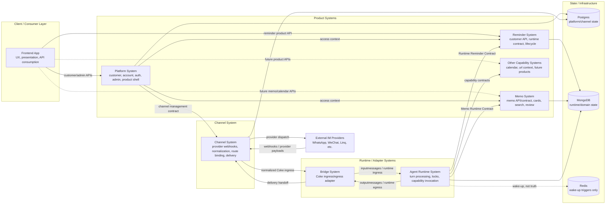
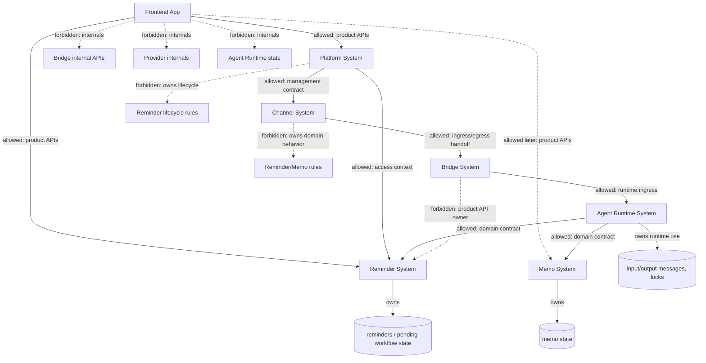

# Frontend Platform Channel Boundary Design

## Status

- **Date:** 2026-05-19
- **State:** Draft — ownership boundary statement only, no service or
  directory split.
- **Intended consumers:** future PRs touching `gateway/`, `agent/`,
  `connector/clawscale_bridge/`, and any new product surface (Reminder,
  Memo, future capabilities).
- **Exit criteria:** items in [Unresolved Seams](#unresolved-seams) each
  carry an owner and a follow-up plan; this doc is referenced from
  `docs/design-docs/coke-working-contract.md` once promoted out of Draft.
- **Normative location:** the per-system **Boundary Rule** blocks are
  normative. Diagrams, "Allowed Interaction Summary," "First-Pass Module
  Interaction," and "Initial Review Rules" are illustrative restatements;
  if any of them conflict with a Boundary Rule, the Boundary Rule wins.

## Goal

Define the first architecture-module cut by separating concepts that are
currently easy to treat as one system. The first group covers the current
`gateway/` area:

- Frontend App
- Platform System
- Channel System

The second group covers the backend runtime path:

- Reminder System
- Memo System
- Other Capability Systems
- Bridge System
- Agent Runtime System
- State and Infrastructure System

This document is intentionally about architecture ownership, not physical
service extraction. The systems may continue to share the current monorepo,
runtime process, and deployment unit while their boundaries are made explicit.

## Context

Current code places the customer/admin web app, platform APIs, channel ingress,
provider adapters, outbound delivery, shared channel types, and some
customer-facing product APIs under `gateway/`.

That directory shape makes development convenient, but it hides distinct
ownership boundaries. The risk is that future work treats `gateway` as a
single architecture module and keeps coupling UI, platform account concerns,
provider behavior, and product-domain behavior together.

The boundary problem is not only "frontend and backend are not separated."
The deeper problem is that the frontend is not consistently modeled as an API
consumer, and the backend side mixes platform ownership with external IM
channel ownership.

## Relationship to Existing Canonical Docs

This spec adds an **ownership** axis. It does not replace the **planning
surface** axis defined in
[`coke-working-contract.md`](../../design-docs/coke-working-contract.md).

- Planning surfaces (`worker-runtime`, `bridge`, `gateway-api`,
  `gateway-web`, `deploy`, `repo-os`) describe **where verification runs and
  who reviews a change** — they map to directories and CI surfaces.
- Ownership systems in this doc (Frontend, Platform, Channel, Reminder,
  Memo, Other Capability, Bridge, Agent Runtime, State) describe **who owns
  the truth and the contract** for a behavior, independent of where its
  current files live.

A single change can touch one planning surface (for example `gateway-api`)
while affecting multiple ownership systems (Platform + Channel + Reminder).
[Initial Review Rules](#initial-review-rules) classify changes by
ownership; planning surfaces still drive verification routing via
`zsh scripts/suggest-verification --base HEAD~1`.

This spec also assumes the
[Agent Capability Contract](../../design-docs/agent-capability-contract.md)
rule: every agent-facing capability exposes a domain contract, and adapters
(Agno tools, HTTP routes, MCP, CLI, web) call that contract rather than
owning behavior. The "Runtime Reminder Contract," "Memo Runtime Contract,"
and the contracts under Other Capability Systems are concrete instances of
that rule and should be reviewed against it.

## Design Principle

Frontend owns experience, not business truth.

Platform owns customer, account, auth, admin, and product-shell concerns.

Channel owns external IM/provider integration, routing, and delivery.

Product systems such as Reminder and Memo should expose product-facing APIs or
contracts that the frontend and runtime can consume without depending on
internal storage or provider details.

Reminder owns reminder truth.

Memo owns memo truth.

Agent Runtime consumes Reminder contracts.

Bridge adapts Coke ingress and egress only.

State stores are infrastructure; collections and tables must still have
product or runtime owners.

## Target System Map

This map shows architecture ownership, not required process or repository
layout.



## Target Module List

The first architecture cut contains these ownership systems:

| System | Primary responsibility | Not responsible for |
| --- | --- | --- |
| Frontend App | UX, presentation, view models, API consumption | Business truth, provider semantics, runtime state |
| Platform System | Customer/account/auth/admin/product shell | Provider protocols, product lifecycle truth |
| Channel System | External IM integration, routing, delivery | Product domain behavior, frontend presentation |
| Reminder System | Reminder API, runtime contract, lifecycle, schedule | Worker lifecycle, provider dispatch, platform account truth |
| Memo System | Memo contract/API, memo cards, search, review, proposals | Worker lifecycle, frontend implementation, provider dispatch |
| Other Capability Systems | Capability-specific contracts for calendar, URL context, future products | Generic turn execution, platform shell, channel provider logic |
| Bridge System | Coke ingress/egress protocol adaptation | Product APIs, lifecycle rules, provider implementation |
| Agent Runtime System | Turn processing, locks, batching, capability invocation | Product API ownership, provider semantics, product lifecycle truth |
| State and Infrastructure System | Storage engines, wake-up plumbing, deployment/config substrate | Owning product meaning without a product/runtime owner |

## Allowed Interaction Summary



## System 1: Frontend App

### Owns

- User interface composition.
- Page routing.
- Presentation and view models.
- Form state and local validation.
- Loading, error, and empty states.
- API client wrappers for product APIs.
- Light display-only transformations.

### Does Not Own

- Product lifecycle rules.
- Reminder recurrence or lifecycle truth.
- Channel provider semantics.
- Permission, account, billing, or entitlement truth.
- Runtime state machines.
- MongoDB, Postgres, or Redis schema meaning.
- Bridge internal APIs.
- Provider webhook or outbound delivery behavior.

### Current Concerns

`gateway/packages/web/lib/customer-reminders.ts` maps frontend repeat choices
to RRULE strings and back. That is acceptable only while it remains a form
adapter. It should not grow into reminder recurrence policy or lifecycle
behavior.

`gateway/packages/web/lib/customer-wechat-channel.ts` maps channel statuses to
view-model copy. That is acceptable display logic. The frontend should not
derive allowed channel actions, provider behavior, or lifecycle transitions
from those statuses.

### Boundary Rule

Frontend App may consume multiple product APIs:

```text
Frontend App
  -> Platform API
  -> Reminder API
  -> future Memo API
  -> future Calendar API
```

Frontend App must not consume backend internals:

```text
Frontend App
  -/-> Bridge internal API
  -/-> provider webhook routes
  -/-> MongoDB runtime schema
  -/-> Channel provider config internals
  -/-> Agent Runtime state
```

## System 2: Platform System

### Owns

- Customer identity.
- Account lifecycle.
- Authentication and session context.
- Admin/customer management.
- Subscription and billing surfaces.
- Product-shell navigation and access context.
- Customer-safe APIs for account and product entry points.

### Does Not Own

- External IM provider protocols.
- Provider webhook normalization.
- Provider-specific outbound dispatch.
- Reminder lifecycle behavior.
- Agent turn processing.
- Runtime scheduling.
- Channel delivery implementation.

### Current Concerns

`gateway/packages/api/src/index.ts` mounts routes with several different
ownership models in one server entrypoint:

- internal platform routes
- customer auth and claim routes
- customer reminder routes
- customer channel routes
- admin customer/shared-channel/delivery routes
- outbound route
- `/gateway` provider ingress route

Sharing one process is acceptable. Treating all of these routes as one
Platform System is not.

The Platform System can be the user-facing shell and access context, but it
should not become the permanent pass-through owner for every product domain or
channel concern.

### Boundary Rule

Platform System may:

- Authenticate the user/customer.
- Resolve account and customer context.
- Expose platform/customer/admin APIs.
- Coordinate access to product systems through explicit product APIs.
- Provide management entry points for channels.

Platform System must not:

- Implement provider webhook logic.
- Own provider credentials beyond customer-safe management metadata.
- Implement reminder lifecycle decisions.
- Read or write product runtime state directly unless that state is explicitly
  owned by Platform.
- Turn into a generic facade that hides unclear ownership.

## System 3: Channel System

### Owns

- External IM/provider webhook handling.
- Provider payload normalization.
- Provider-specific credentials and config.
- Shared-channel provisioning.
- Channel binding.
- Route binding.
- Delivery route selection.
- Outbound provider dispatch.

### Does Not Own

- Frontend presentation.
- Customer/account truth.
- Reminder or Memo domain behavior.
- Agent turn processing.
- Product lifecycle state.
- Product customer APIs except where the API is explicitly channel-management
  related.

### Current Concerns

Channel code is spread across multiple places:

- `gateway/packages/api/src/gateway/`
- `gateway/packages/api/src/adapters/`
- `gateway/packages/api/src/lib/*evolution*`
- `gateway/packages/api/src/lib/*wechat*`
- `gateway/packages/api/src/lib/*linq*`
- `gateway/packages/api/src/routes/*channel*`
- `gateway/packages/api/src/routes/outbound.ts`
- `gateway/packages/shared/src/types/channel.ts`

`gateway/packages/shared/src/types/channel.ts` mixes active provider types,
future-looking provider types, UI form schemas, and provider config fields in
a package that frontend code can import. This can leak Channel internals into
Frontend and Platform code.

This file is the load-bearing leak vector for the Frontend ↔ Channel
boundary rule. The Boundary Rule below is not enforceable until
`gateway/packages/shared` is split into a frontend-safe product-types
subpackage and a backend-only provider/channel subpackage. Treat that
split as a prerequisite for enforcement, not a follow-up nicety; do not
add new provider-only fields to `shared/src/types/channel.ts` in the
meantime. See [Unresolved Seams](#unresolved-seams).

### Boundary Rule

Channel System may expose customer-safe management contracts upward, but it
owns provider details internally.

```text
Platform API
  -> channel management contract
  -> Channel System
  -> provider integration
```

Frontend should not directly understand provider config internals. A channel
management page may show customer-safe fields, statuses, and actions, but the
meaning and allowed transitions belong to backend contracts.

## First-Pass Module Interaction

```text
Frontend App
  -> consumes Platform API
  -> consumes Reminder API
  -> later consumes Memo API / Calendar API

Platform System
  -> owns customer/account/auth/admin/product shell
  -> may call Channel management contracts
  -> may provide product entry context

Channel System
  -> receives provider webhooks
  -> normalizes external IM messages
  -> owns routing and delivery routes
  -> calls Bridge System ingress-egress contracts for Coke runtime handoff

Reminder System
  -> exposes customer-facing Reminder API
  -> exposes Runtime Reminder Contract
  -> owns lifecycle, schedule, recurrence, and reminder domain state

Bridge System
  -> adapts Channel/Platform messages into Coke runtime ingress
  -> adapts Coke output into delivery handoff
  -> does not expose Reminder product APIs

Agent Runtime System
  -> processes turns and invokes capabilities
  -> consumes Reminder Runtime Contract
  -> does not own Reminder lifecycle truth
```

## Important Distinction

Channel and Platform are both backend systems, but they answer different
questions.

Platform answers:

```text
Who is using the system?
Which customer/account is this?
What can this user manage?
Which product surfaces are available?
```

Channel answers:

```text
Which external IM/provider sent this?
How is its payload normalized?
Which customer and route does it belong to?
How should an outbound reply be delivered?
```

External IM integration belongs to Channel System. Platform may provide the
customer/admin management entry point for channel configuration, but it should
not implement provider ingress or dispatch behavior.

## Initial Review Rules

Use these rules during code review before deeper refactoring exists:

- Frontend code may add display logic, but must not add backend business truth.
- Frontend API clients should target product APIs, not backend internal routes.
- Platform routes may own account/customer/admin concerns, but should not
  absorb product-domain behavior by default.
- Channel provider logic should stay behind Channel contracts and not leak
  into shared frontend-importable config structures.
- A route mounted in `gateway/packages/api` is not automatically owned by the
  Platform System. Its owner must be identified by behavior.
- If a change modifies channel provider behavior, classify it as Channel
  System even when the file path is under `gateway/packages/api`.
- If a change modifies customer/account/auth/admin behavior, classify it as
  Platform System.
- If a change modifies view state or API consumption only, classify it as
  Frontend App.
- If a change modifies reminder lifecycle, schedule, recurrence, or customer
  reminder management behavior, classify it as Reminder System even when the
  current file path is under `agent/`, `connector/`, or `gateway/`.
- If a change adapts external messages into Coke runtime input or adapts Coke
  output to delivery handoff, classify it as Bridge System.
- If a change modifies turn processing, locks, batching, capability invocation,
  runtime events, or output message creation, classify it as Agent Runtime
  System.

## System 4: Reminder System

### Owns

- Customer-facing Reminder API.
- Runtime Reminder Contract.
- Reminder lifecycle.
- Reminder schedule and recurrence.
- Visible reminder state.
- Internal follow-up boundary — reminders with `visibility="internal"` and
  `fire_mode="followup"` that bring a conversation back to itself without
  surfacing a customer-visible reminder. Implemented today via
  `ReminderService.create_or_replace_internal_followup` and
  `clear_internal_followup` in `agent/reminder/service.py`, exposed on the
  Runtime Reminder Contract (`agent/reminder/runtime_contract.py`), fired
  through `agent/runner/reminder_event_handler.py` as
  `kind="internal_followup"`, and planned each turn by the FollowupPlan
  step in `agent/agno_agent/workflows/post_analyze_workflow.py`. This
  subsumes the previous Deferred Action `proactive_followup` path; see
  [Deferred Action Retirement](#deferred-action-retirement).
- Reminder fire event contract.
- Reminder domain state and state transitions.

### Does Not Own

- Frontend presentation.
- Platform account/customer truth.
- External IM provider behavior.
- Channel delivery implementation.
- Bridge ingress/egress adaptation.
- Agent worker lifecycle.
- Conversation locking and batching.

### Boundary Rule

Reminder System is an independent product system, not an Agent Runtime tool, a
Bridge management endpoint, or a Platform-owned customer page backend.

Frontend may consume a customer-facing Reminder API:

```text
Frontend App
  -> Reminder API
  -> Reminder System
```

Agent Runtime may consume the Runtime Reminder Contract:

```text
Agent Runtime
  -> Reminder Runtime Contract
  -> Reminder System
```

Platform may provide account, customer, and access context around Reminder
surfaces, but it must not own reminder lifecycle rules.

Bridge may adapt integration requests when necessary, but it must not become
the customer-facing Reminder API owner.

### Current Concerns

Current Reminder behavior spans worker runtime, scheduler, bridge management
adapters, customer routes, and MongoDB state. That is acceptable as an
implementation stage, but the ownership target should be explicit:

```text
Reminder System owns reminder truth.
Other systems consume Reminder contracts.
```

The same rule applies to visible reminders and internal follow-ups. They may
share implementation mechanics, but the customer-visible and internal runtime
semantics must remain explicit.

Current code anchors:

- Runtime contract: `agent/reminder/runtime_contract.py` (with
  `agent/reminder/runtime.py` as the runtime entry) and supporting modules
  under `agent/agno_agent/runtime/`.
- Domain service: `agent/reminder/service.py`.
- Scheduler and fire path: `agent/runner/reminder_scheduler.py`,
  `agent/runner/reminder_fire_consumer.py`,
  `agent/runner/reminder_event_handler.py`.
- Customer-facing routes: `gateway/packages/api/src/routes/customer-reminder-routes.ts`.
- Durable state: MongoDB `reminders` (and feature-flagged `pending_workflows`
  for in-flight reminder intent).

### Deferred Action Retirement

`deferred_actions` was originally a separate scheduling capability with its
own scheduler, executor, DAO layer, and MongoDB collections. The
`proactive_followup` kind has already migrated to Reminder System internal
reminders — see
`UNSUPPORTED_DEFERRED_ACTION_KINDS = {"proactive_followup"}` in
`agent/runner/deferred_action_executor.py`. The remaining deferred-action
kinds are reminder-shaped (schedule a future return into the conversation
with a typed payload), so this spec retires Deferred Action as a separate
capability:

- New internal scheduled callbacks must use Reminder System internal
  reminders (`visibility="internal"`, `fire_mode="followup"`) via the
  Runtime Reminder Contract. Do not introduce new deferred-action kinds.
- The following modules and collections should be retired alongside the
  migration of any remaining live kinds:
  - `agent/runner/deferred_action_scheduler.py`
  - `agent/runner/deferred_action_executor.py`
  - `agent/runner/deferred_action_policy.py`
  - `dao/deferred_action_dao.py`
  - `dao/deferred_action_occurrence_dao.py`
  - `agent/agno_agent/adapters/deferred_action_result.py`
  - MongoDB `deferred_actions` and `deferred_action_occurrences` collections
- Until that retirement is complete, the live Deferred Action code is
  Reminder-System-owned for contract direction (Reminder owns the
  contract that replaces it) and Agent-Runtime-hosted for scheduling
  mechanics (because the executor still runs there). No new ownership
  ambiguity remains.

## System 5: Memo System

### Owns

- Memo Runtime Contract.
- Future customer-facing Memo API.
- Memo cards.
- Memo events.
- Memo proposals.
- Memo search.
- Memo review queue.
- Memo storage and migrations.

### Does Not Own

- Frontend implementation.
- Agent worker lifecycle.
- Turn processing.
- Provider webhook behavior.
- Channel delivery.
- Platform account truth.

### Current Concerns

Memo runtime contract and capability adapter landed recently and are the
reference shape for the Agent Capability Contract rule:

- Runtime package: `memo-runtime/memo_runtime/`.
- Capability adapter consumed by Agent Runtime:
  `agent/agno_agent/capabilities/memo.py`.
- Storage: see modules under `memo-runtime/memo_runtime/storage/`.

A customer-facing Memo API does not yet exist. Until it does, treat Memo as
runtime-contract-only on the consumer side; do not introduce frontend memo
flows that read or write memo storage outside this contract.

### Boundary Rule

Memo System should follow the same product-system direction as Reminder: it
owns memo truth and exposes contracts to consumers.

```text
Agent Runtime
  -> Memo Runtime Contract
  -> Memo System

Frontend App
  -> future Memo API
  -> Memo System
```

Memo already has a clearer contract-first shape than several other systems.
The architecture rule is to preserve that boundary rather than let Agent
Runtime or Frontend code write memo storage directly.

## System 6: Other Capability Systems

### Owns

- Capability-specific product or runtime contracts.
- Capability-specific validation and state transitions where applicable.
- Capability adapters for Agent Runtime.

### Does Not Own

- Generic turn execution.
- Platform account/auth/admin shell.
- Channel provider integration.
- Bridge ingress/egress.

### Boundary Rule

Not every capability needs to become a standalone product system. The decision
rule is:

- If a capability has customer-facing management, durable product state, or
  lifecycle rules, model it as a product system with an API or contract.
- If a capability is a stateless helper for a turn, keep it as an Agent
  Runtime capability adapter behind a narrow contract.
- Do not create a generic capability framework before at least two systems
  prove the same abstraction is useful.

### Current Interim Owners

These capabilities exist today but are not yet first-class systems in the
list above. Until a follow-up spec promotes them, treat them as Other
Capability Systems with the noted interim home:

- **Calendar import** — handoff and runtime routes live under
  `gateway/packages/api/src/routes/customer-google-calendar-*` and
  `gateway/packages/api/src/lib/google-calendar-*`. Classify as an Other
  Capability System with Platform-provided customer/account context.

Deferred Action is **not** in this list. It is being retired into Reminder
System internal reminders — see
[Deferred Action Retirement](#deferred-action-retirement).

## System 7: Bridge System

### Owns

- Coke ingress adaptation.
- Coke egress adaptation.
- Converting external, platform, or channel messages into Coke runtime input.
- Converting Coke output into delivery handoff.
- Bridge auth for internal integration.
- Synchronous reply waiting.
- Late reply promotion and related protocol-adapter behavior.

### Does Not Own

- Reminder customer-facing API.
- Reminder lifecycle or schedule rules.
- Memo behavior.
- Platform account/customer rules.
- Provider webhook implementation.
- Provider-specific outbound dispatch.
- Agent turn behavior.
- Frontend API shape.

### Boundary Rule

Bridge adapts protocols. It does not own domain behavior.

Use Bridge when crossing into or out of Coke runtime message flow:

```text
Channel System
  -> Bridge System
  -> Agent Runtime System

Agent Runtime System
  -> Bridge System
  -> Channel delivery handoff
```

Do not use Bridge as the product API owner:

```text
Frontend App
  -/-> Bridge Reminder API

Platform System
  -/-> Bridge-owned product lifecycle rules
```

Bridge may keep internal integration routes while current implementation
requires them, but those routes should not grow into customer-facing product
APIs.

### Current Concerns

`connector/clawscale_bridge/app.py` exposes several kinds of routes today.
Under this design they classify as follows — no future-tense migration is
left open:

- **Bridge-owned (stays in Bridge)**: internal integration auth
  (`require_bridge_auth` / `_require_internal_bridge_auth` in
  `connector/clawscale_bridge/auth.py` and `app.py`), ingress and egress
  endpoints, delivery-route binding inside the bridge
  (`delivery_route_client.bind()` in `app.py`), reply waiting, late reply
  promotion, and the Coke-specific bridge APIs that exist purely for
  gateway↔bridge integration. These are infrastructural; they stay
  Bridge-owned.
- **Platform-owned (already lives in `gateway/`, must not move back)**:
  customer authentication, account state, claim flow, and customer↔channel
  binding — `gateway/packages/api/src/routes/customer-auth-routes.ts`,
  `customer-claim-routes.ts`, and `customer-channel-routes.ts`. Bridge
  must not add any customer-facing auth or bind endpoint. If such a need
  appears, build it in the gateway as a Platform route.
- **Platform→Bridge contract (already exists, do not bypass)**:
  `gateway/packages/api/src/routes/coke-bindings.ts`
  (`/api/internal/coke-bindings`) and `coke-user-provision.ts`
  (`/api/internal/coke-users/provision`) are the only sanctioned channels
  for Platform to push customer/channel state into Bridge. Bridge owns
  the shape of these contracts; Platform owns when they are called. No
  other path may write Bridge state from outside Bridge.

The earlier "user auth, bind flow" wording in `docs/ARCHITECTURE.md` is
historical and should be read in light of this classification rather than
as a Bridge ownership claim.

## System 8: Agent Runtime System

### Owns

- Message workers.
- Turn processing.
- Conversation locks.
- Pending-message batching.
- Agno Agent construction.
- Capability invocation.
- Runtime events.
- Output message creation.
- Background/runtime continuation behavior.

### Does Not Own

- Customer-facing APIs.
- Frontend API shape.
- Platform account/admin UI.
- Provider webhook semantics.
- Channel-specific dispatch.
- Reminder lifecycle truth.
- Memo domain truth.
- Product management surfaces.

### Boundary Rule

Agent Runtime is an execution engine. It should call domain contracts rather
than duplicate product-system behavior.

For Reminder:

```text
Agent Runtime
  -> Reminder Runtime Contract
  -> Reminder System
```

Agent Runtime may decide that a turn needs a reminder action, but Reminder
System owns whether that action is valid, how it changes lifecycle state, how
schedule/recurrence is represented, and what durable reminder state means.

### Current Concerns

The current runtime starts message workers, Reminder scheduling, deferred
actions, and background maintenance from the same runtime area. This document
does not require splitting processes. It does require separating ownership:

```text
Agent Runtime owns turn execution.
Reminder System owns reminder behavior.
Bridge owns ingress/egress adaptation.
```

## System 9: State and Infrastructure System

### Owns

- Storage engines as infrastructure.
- Redis wake-up plumbing.
- Deployment substrate.
- Runtime configuration substrate.
- Observability and evidence plumbing where not owned by a product system.

### Does Not Own

- Product meaning.
- Lifecycle rules.
- Runtime behavior.
- Customer-facing API semantics.

### Boundary Rule

Databases do not own business meaning. Every collection, table, stream, or
queue must have a product or runtime owner.

First-pass ownership:

| State | First-pass owner | Notes |
| --- | --- | --- |
| Postgres customer/account/admin state | Platform System | Platform owns customer/account/auth/admin truth. |
| Postgres channel/provider config and route binding | Channel System | Platform may expose management APIs, but Channel owns provider meaning. |
| MongoDB `reminders` | Reminder System | Includes visible reminders and internal follow-up semantics. |
| MongoDB `pending_workflows` for reminders | Reminder System | Feature-flagged workflow state still belongs to Reminder when reminder-specific. |
| MongoDB `inputmessages` / `outputmessages` | Agent Runtime System with Bridge boundary | Bridge adapts ingress/egress; Agent Runtime processes durable runtime messages. |
| MongoDB conversation locks and batching state | Agent Runtime System | Runtime coordination state, not product state. |
| MongoDB `deferred_actions` / `deferred_action_occurrences` | Reminder System (retiring) | Being retired; new internal scheduled callbacks go through Reminder System internal reminders. See [Deferred Action Retirement](#deferred-action-retirement). |
| Memo storage | Memo System | Memo Runtime owns memo domain state and migrations. |
| Redis stream triggers | Agent Runtime System | Wake-up only, never business truth. |

If a future change needs a collection or table that crosses owners, the design
must name the owner of lifecycle transitions and the allowed readers/writers.

## Unresolved Seams

These are boundary points this spec names but does not resolve. A PR that
touches one of these needs a paragraph explaining its position; the next
iteration of this spec should pick a direction.

### Channel ↔ Platform management contract

`gateway/packages/api/src/routes/customer-channel-routes.ts` is
customer-facing (Platform-shaped) but mutates provider/channel state
(Channel-shaped). The spec asserts both that Platform "may call Channel
management contracts" and that Channel "may expose customer-safe management
contracts upward," but the actual shape of that contract — HTTP module,
in-process service interface, or shared package — is undecided. Until
decided, treat current channel routes as a thin Platform adapter over
Channel internals, and do not add new provider-aware logic into the route
layer.

### `gateway/packages/shared` split

Today's `shared` package is importable from both `web` and `api`. The
Boundary Rules for Frontend App (System 1) and Channel System (System 3)
are not enforceable until `shared` is split into a frontend-safe
product-types subpackage and a backend-only provider/channel subpackage.
No new provider-only fields should be added to
`shared/src/types/channel.ts` in the meantime.

## Enforcement Targets

The Initial Review Rules above are human-applied. The following are
candidate guardrails for follow-up work — none are required by this spec
to land, but they are the targets that would make the boundary
machine-defensible over time:

- **Import-boundary lint in `gateway/`**: forbid `packages/web` from
  importing provider-specific fields out of
  `packages/shared/src/types/channel.ts` (paired with the shared-package
  split above).
- **Ownership fitness surface**: extend `docs/fitness/surfaces.yaml` with
  `product-reminder` and `product-memo` surfaces so changes that touch
  reminder or memo runtime contracts get routed to the right verification
  command set via `zsh scripts/suggest-verification`.
- **Route ownership annotation**: a small `scripts/check`-style repo-os
  rule that fails when a new customer-facing route under
  `gateway/packages/api/src/routes/` does not declare which ownership
  system it belongs to (header comment or registry entry), to prevent
  the "everything lives in `index.ts`" drift.

## Non-goals

- Do not split services or processes in this design.
- Do not rename directories in this design.
- Do not fully classify every existing file into these systems in this design.
- Do not introduce a generic capability framework.
- Do not require a full API versioning strategy yet.

## Follow-up Questions

Open questions not promoted to [Unresolved Seams](#unresolved-seams):

- Should customer-facing Reminder API live in the current API process as an
  independently-owned Reminder module, or move behind a separate HTTP adapter
  later?
- Which channel state fields are safe frontend product fields, and which are
  provider internals? (Inputs to the shared-package split.)
- Which current routes under `gateway/packages/api/src/index.ts` should be
  tagged as Platform, Channel, Reminder, Bridge-facing internal, or Delivery?
- Which existing Reminder routes and bridge adapters should be treated as
  temporary adapters versus long-term Reminder API surfaces?
- Which current Agent Runtime files own generic turn execution, and which are
  hosting Reminder or Deferred Action behavior that should be classified under
  product/domain systems?
- What is the smallest guardrail that prevents Bridge code from accumulating
  product lifecycle rules? (See [Enforcement Targets](#enforcement-targets)
  for candidates.)
- Which current states need owner annotations in code or docs first?
